# 분산 KV 스토어

> 현재는 Paxos 알고리즘만 지원하며, 추후 Raft를 추가할 예정입니다.

## 목차

- [0. 실행 방법](#0-실행-방법)
- [1. 노드 생성 및 실행(main.go)](#1-노드-생성-및-실행maingo)
- [2. 리더 선출(paxos.go)](#2-리더-선출paxosgo)
  - [2-3. Leader Lease 및 선거 최적화](#2-3-leader-lease-및-선거-최적화)
- [3. 리더: Put 요청 수신(http.go)](#3-리더-put-요청-수신httpgo)
- [4. 리더: 합의 제안 및 결과 수신(paxos.go)](#4-리더-합의-제안-및-결과-수신paxosgo)
- [5. 팔로워: 리더의 Accept 요청 수신(grpc_server.go -> paxos.go -> acceptor.go)](#5-팔로워-리더의-accept-요청-수신grpc_servergo---paxosgo---acceptorgo)
- [6. 팔로워: 리더의 Commit 수신(paxos.go)](#6-팔로워-리더의-commit-수신paxosgo)
- [7. 팔로워: 하트비트 수신 처리(paxos.go)](#7-팔로워-하트비트-수신-처리paxosgo)
- [8. 팔로워: Catchup 루프(paxos.go)](#8-팔로워-catchup-루프paxosgo)
- [9. applyLoop: WAL-first 쓰기(node.go)](#9-applyloop-wal-first-쓰기nodego)
- [10. snapshotLoop: 스냅샷 생성(node.go)](#10-snapshotloop-스냅샷-생성nodego)
- [11. 리더: Get, Delete 요청 처리(http.go)](#11-리더-get-delete-요청-처리httpgo)

## 0. 실행 방법

### 프로젝트 구조

```
dkv/
├── cmd/
│   └── dkv/
│       └── main.go                  # 엔트리포인트 — 노드 생성 및 시작
├── config/
│   └── config.go                    # 클러스터 설정 (노드 ID, 주소, 포트 등)
├── consensus/
│   ├── consensus.go                 # Consensus 인터페이스 정의
│   └── paxos/
│       ├── acceptor.go              # Acceptor — Prepare/Accept 요청 처리
│       ├── ballot.go                # Ballot 비교 유틸리티
│       ├── log.go                   # ReplicatedLog — 슬롯 기반 로그 관리
│       ├── paxos.go                 # MultiPaxos — 리더 선출, Propose, 하트비트, Catchup
│       ├── proposer.go             # Proposer — ballot 관리
│       └── *_test.go                # (ballot, single decree, multi paxos 테스트)
├── node/
│   ├── node.go                      # Node — WAL 복구, applyLoop, snapshotLoop
│   └── *_test.go                    # (단일 노드 영속성, 3노드 통합 테스트)
├── server/
│   └── http.go                      # HTTPServer — GET/PUT/DELETE REST API
├── statemachine/
│   ├── kvstore.go                   # KVStore — in-memory key-value 상태 머신
│   └── *_test.go                    # (PUT/GET/DEL, 멱등성, 스냅샷 테스트)
├── storage/
│   ├── snapshot/
│   │   └── snapshot.go              # 스냅샷 저장/로드
│   └── wal/
│       ├── wal.go                   # WAL — Append, ReadAll, Reset
│       └── *_test.go                # (Append/ReadAll, Reopen, Truncation, Reset 테스트)
├── transport/
│   ├── grpc.go                      # GRPCTransport — outbound gRPC 클라이언트
│   ├── grpc_server.go               # GRPCServer — inbound gRPC 서버
│   ├── memory.go                    # InMemoryTransport — 테스트용 in-memory 전송
│   ├── transport.go                 # Transport 인터페이스 정의
│   └── proto/
│       ├── dkv.proto                # protobuf 정의 파일
│       └── dkvpb/
│           └── *.pb.go              # (protoc 생성 파일)
├── Makefile
├── go.mod
└── README.md
```

### 0-1. 3개 노드 실행 및 확인

#### 바이너리 빌드

> go 1.26.1 에서 테스트 되었습니다.

```bash
# 패키지 다운로드 및 정리
go mod tidy
# 빌드
go build -o dkv ./cmd/dkv
```

#### 3개 노드 시작

터미널 3개를 열고, 각각 아래 명령을 실행한다.

```bash
# 터미널 1
go run ./cmd/dkv -id=1

# 터미널 2
go run ./cmd/dkv -id=2

# 터미널 3
go run ./cmd/dkv -id=3
```

각 노드의 기본 주소는 다음과 같다. (`config/config.go`의 `DefaultCluster` 참조)

| 노드 | HTTP 주소 | gRPC 주소 | 데이터 디렉터리 |
|------|-----------|-----------|----------------|
| 1 | `127.0.0.1:8001` | `127.0.0.1:9001` | `/tmp/dkv/node-1` |
| 2 | `127.0.0.1:8002` | `127.0.0.1:9002` | `/tmp/dkv/node-2` |
| 3 | `127.0.0.1:8003` | `127.0.0.1:9003` | `/tmp/dkv/node-3` |

`-verbose` 플래그를 추가하면 DEBUG 레벨 로그가 출력된다.

```bash
./dkv -id=1 -verbose
```

3개 노드가 모두 시작되면 자동으로 리더 선출이 진행된다.

#### curl로 테스트하기

리더가 선출된 후, 아무 노드에 요청을 보내면 된다. 팔로워에 쓰기 요청을 보내면 리더에게 자동 리다이렉트된다. (`-L` 플래그로 리다이렉트를 따라간다.)

**PUT (값 저장)**

```bash
curl -L -X PUT -d "hello" http://127.0.0.1:8001/kv/mykey
```

**GET (값 조회)**

```bash
curl http://127.0.0.1:8001/kv/mykey
```

**DELETE (값 삭제)**

```bash
curl -L -X DELETE http://127.0.0.1:8001/kv/mykey
```

#### 복제 확인

PUT 요청 후, 다른 노드에서도 동일한 값이 조회되는지 확인한다. GET은 로컬 KVStore에서 직접 읽기 때문에 합의 없이 모든 노드에서 처리된다.

```bash
# 노드 1에 값 저장
curl -L -X PUT -d "world" http://127.0.0.1:8001/kv/greeting

# 노드 2에서 조회
curl http://127.0.0.1:8002/kv/greeting

# 노드 3에서 조회
curl http://127.0.0.1:8003/kv/greeting
```

3개 노드 모두 `world`가 반환되면 Paxos 합의를 통한 복제가 정상 동작하는 것이다.

### 0-2. 테스트 실행 방법

#### 전체 테스트 실행

`dkv/` 디렉터리에서 실행한다.

```bash
go test ./... -v -count=1
```

또는 Makefile을 사용한다.

```bash
make test
```

#### 패키지별 테스트 실행

```bash
# Ballot 비교, Single Decree Paxos, Multi-Paxos 테스트
go test ./consensus/paxos/... -v

# 단일 노드 영속성 + 3노드 통합 테스트
go test ./node/... -v

# KVStore 상태 머신 테스트 (PUT/GET/DEL, 멱등성, 스냅샷/복원)
go test ./statemachine/... -v

# WAL 테스트 (Append/ReadAll, Reopen 생존, 손상된 레코드 스킵, Reset)
go test ./storage/wal/... -v
```

#### 테스트 패키지 설명

| 패키지 | 테스트 파일 | 주요 테스트 내용 |
|--------|------------|-----------------|
| `consensus/paxos` | `ballot_test.go` | Ballot 비교 로직 (제안 번호, 노드 ID 기반 순서) |
| `consensus/paxos` | `single_decree_test.go` | Single Decree Paxos (단일 제안자, 동시 제안자, 노드 장애 시나리오) |
| `consensus/paxos` | `multi_paxos_test.go` | Multi-Paxos (리더 선출, Propose/Commit, 리더 장애 복구) |
| `node` | `single_node_test.go` | 단일 노드의 WAL/스냅샷 기반 영속성 및 복구 |
| `node` | `integration_test.go` | 3개 노드 클러스터 통합 테스트 (PUT 복제 확인) |
| `statemachine` | `kvstore_test.go` | KVStore의 PUT/GET/DEL, 멱등성, 스냅샷 생성 및 복원 |
| `storage/wal` | `wal_test.go` | WAL의 Append/ReadAll, 파일 재오픈 생존, 손상 레코드 스킵, Reset |

### 0-3. protobuf 갱신 방법

`Makefile`은 다음과 같이 protobuf 및 기타 명령을 포함하고 있다.

```make
.PHONY: proto clean test

proto:
	mkdir -p transport/proto/dkvpb
	protoc \
		--proto_path=transport/proto \
		--go_out=transport/proto/dkvpb --go_opt=paths=source_relative \
		--go-grpc_out=transport/proto/dkvpb --go-grpc_opt=paths=source_relative \
		transport/proto/dkv.proto

clean:
	rm -rf transport/proto/dkvpb/*.go

test:
	go test ./... -v -count=1
```

`dkv.proto` 파일 수정 후, `make proto` 를 실행하여 필요한 파일을 생성하고, `go build ./...`를 실행하여 빌드를 확인한다.


## 1. 노드 생성 및 실행(main.go)

### 1-1. 관련 클래스 구조

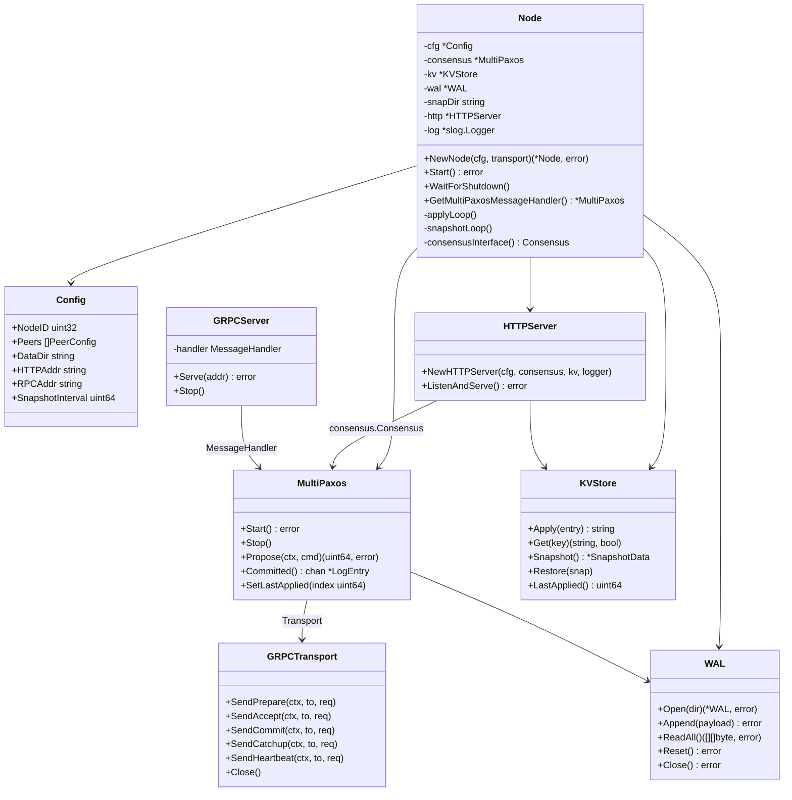
```mermaid
classDiagram
    class Node {
        -cfg *Config
        -consensus *MultiPaxos
        -kv *KVStore
        -wal *WAL
        -snapDir string
        -http *HTTPServer
        -log *slog.Logger
        +NewNode(cfg, transport) (*Node, error)
        +Start() error
        +WaitForShutdown()
        +GetMultiPaxosMessageHandler() *MultiPaxos
        -applyLoop()
        -snapshotLoop()
        -consensusInterface() Consensus
    }
    class Config {
        +NodeID uint32
        +Peers []PeerConfig
        +DataDir string
        +HTTPAddr string
        +RPCAddr string
        +SnapshotInterval uint64
    }
    class MultiPaxos {
        +Start() error
        +Stop()
        +Propose(ctx, cmd) (uint64, error)
        +Committed() chan *LogEntry
        +SetLastApplied(index uint64)
    }
    class KVStore {
        +Apply(entry) string
        +Get(key) (string, bool)
        +Snapshot() *SnapshotData
        +Restore(snap)
        +LastApplied() uint64
    }
    class WAL {
        +Open(dir) (*WAL, error)
        +Append(payload) error
        +ReadAll() ([][]byte, error)
        +Reset() error
        +Close() error
    }
    class HTTPServer {
        +NewHTTPServer(cfg, consensus, kv, logger)
        +ListenAndServe() error
    }
    class GRPCTransport {
        +SendPrepare(ctx, to, req)
        +SendAccept(ctx, to, req)
        +SendCommit(ctx, to, req)
        +SendCatchup(ctx, to, req)
        +SendHeartbeat(ctx, to, req)
        +Close()
    }
    class GRPCServer {
        -handler MessageHandler
        +Serve(addr) error
        +Stop()
    }
    Node --> Config
    Node --> MultiPaxos
    Node --> KVStore
    Node --> WAL
    Node --> HTTPServer
    HTTPServer --> MultiPaxos : consensus.Consensus
    HTTPServer --> KVStore
    GRPCServer --> MultiPaxos : MessageHandler
    MultiPaxos --> GRPCTransport : Transport
    MultiPaxos --> WAL
```

### 1-2. 진행 프로세스

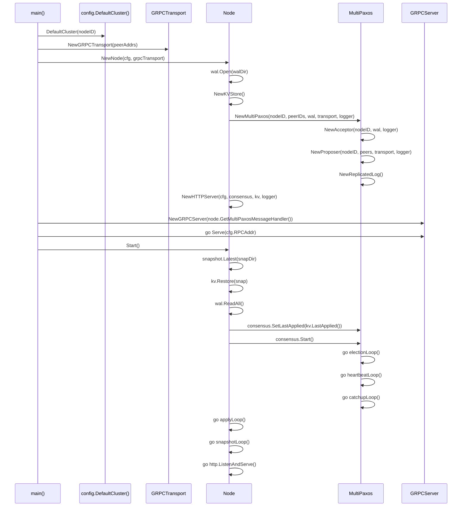
```mermaid
sequenceDiagram
    participant main as main()
    participant cfg as config.DefaultCluster()
    participant gt as GRPCTransport
    participant node as Node
    participant mp as MultiPaxos
    participant gs as GRPCServer

    main->>cfg: DefaultCluster(nodeID)
    main->>gt: NewGRPCTransport(peerAddrs)
    main->>node: NewNode(cfg, grpcTransport)
    node->>node: wal.Open(walDir)
    node->>node: NewKVStore()
    node->>mp: NewMultiPaxos(nodeID, peerIDs, wal, transport, logger)
    mp->>mp: NewAcceptor(nodeID, wal, logger)
    mp->>mp: NewProposer(nodeID, peers, transport, logger)
    mp->>mp: NewReplicatedLog()
    node->>node: NewHTTPServer(cfg, consensus, kv, logger)
    main->>gs: NewGRPCServer(node.GetMultiPaxosMessageHandler())
    main->>gs: go Serve(cfg.RPCAddr)
    main->>node: Start()
    node->>node: snapshot.Latest(snapDir)
    node->>node: kv.Restore(snap)
    node->>node: wal.ReadAll()
    node->>mp: consensus.SetLastApplied(kv.LastApplied())
    node->>mp: consensus.Start()
    mp->>mp: go electionLoop()
    mp->>mp: go heartbeatLoop()
    mp->>mp: go catchupLoop()
    node->>node: go applyLoop()
    node->>node: go snapshotLoop()
    node->>node: go http.ListenAndServe()
```

| Step | File:Line | Description |
|------|-----------|-------------|
| 1 | main.go:44 | outbound(다른 노드에 메세지를 전송하는)용 grpcTransport 생성 |
| 2 | main.go:47, node.go:35-64 | grpcTransport를 사용하는 노드(node) 생성 |
| 2.1 | node.go:36-38 | logger 생성: 로그 메세지 출력 |
| 2.2 | node.go:43-46 | WAL타입의 wal 생성: 로그 엔트리를 임시로 파일에 저장 |
| 2.3 | node.go:48 | KVStore 타입의 kv를 생성: key-value 값을 저장할 KVStore |
| 2.4 | node.go:49, paxos.go:103-120 | MultiPaxos 타입의 consensus를 생성: 추후 리더선출 및 인입되는 grpc 메세지를 처리한다 |
| 2.5 | node.go:61, http.go:28-45 | HTTPServer 타입의 http 생성: key-value 스토어에 대한 Get, Put, Delete 수신 |
| 2.5.1 | http.go:85, http.go:99-103, http.go:114, http.go:122 | consensus를 통해 리더 노드 여부를 확인하고 Put, Delete 메세지를 제안(propose) 한다 |
| 3 | main.go:54-60, grpc_server.go:22-28 | inbound(다른 노드에서 들어오는 메세지 수신)용 grpcServer 생성 |
| 3.1 | grpc_server.go:45-63, paxos.go:389-568 | 인입되는 메세지는 node의 consensus(MultiPaxos)의 Handle* 메서드를 통해 처리한다 |
| 4 | main.go:63, node.go:71-156 | 노드의 Start()를 호출하여 노드를 시작한다 |
| 4.1 | node.go:77-128 | 이전에 해당 노드가 동작한 적이 있다면, 데이터를 복구하는 과정을 시작한다 |
| 4.1.1 | node.go:77-84, snapshot.go:51-85, kvstore.go:77-86 | 최신 스냅샷 파일을 읽어서 kv에 복구한다 |
| 4.1.2 | node.go:93-122, wal.go:67-112 | wal.ReadAll()을 호출해서 혹시 스냅샷 파일에 저장되지 못한 엔트리 기록이 있는지 확인한다 |
| 4.1.2.1 | node.go:100-121, acceptor.go:179-198, kvstore.go:25-49 | 기록이 존재한다면, 엔트리의 타입에 따라 Acceptor와 kv에 적용한다 |
| 4.1.3 | node.go:128, paxos.go:302-313 | WAL 재생 후 consensus.SetLastApplied(kv.LastApplied())를 호출하여, 이미 적용된 엔트리가 commitCh를 통해 다시 전달되지 않도록 lastDelivered를 동기화한다 |
| 4.2 | node.go:135, paxos.go:315-324 | Paxos 프로토콜을 시작한다 |
| 4.2.1 | paxos.go:320, paxos.go:753-790 | electionLoop: 주기적으로 리더 존재 여부를 확인하여 리더를 선출한다 |
| 4.2.2 | paxos.go:321, paxos.go:798-849 | heartbeatLoop: 리더의 경우 주기적으로 자신의 존재를 알리는 하트비트를 전송한다 |
| 4.2.3 | paxos.go:322, paxos.go:334-385 | catchupLoop: 팔로워의 경우 주기적으로 리더에게 수신하지 못한 로그 엔트리가 있는지 요청한다 |
| 4.3 | node.go:142-143 | 백그라운드 루프를 시작한다 |
| 4.3.1 | node.go:142, node.go:159-189 | 리더가 커밋하는 로그 엔트리를 commitCh로 수신하여 처리하는 applyLoop |
| 4.3.2 | node.go:143, node.go:192-210 | 주기적으로 kv의 데이터를 스냅샷으로 생성하고, WAL 파일을 초기화하는 snapshotLoop |
| 4.4 | node.go:148-153, http.go:48-50 | kv 스토어 관련 명령을 수신할 http 서버를 시작한다 |

## 2. 리더 선출(paxos.go)

### 2-1. 관련 클래스 구조

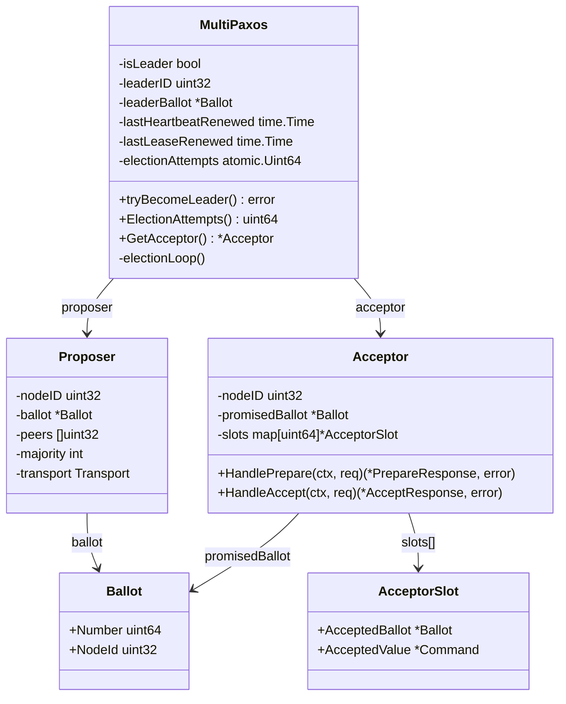
```mermaid
classDiagram
    class MultiPaxos {
        -isLeader bool
        -leaderID uint32
        -leaderBallot *Ballot
        -lastHeartbeatRenewed time.Time
        -lastLeaseRenewed time.Time
        -electionAttempts atomic.Uint64
        +tryBecomeLeader() error
        +ElectionAttempts() uint64
        +GetAcceptor() *Acceptor
        -electionLoop()
    }
    class Proposer {
        -nodeID uint32
        -ballot *Ballot
        -peers []uint32
        -majority int
        -transport Transport
    }
    class Acceptor {
        -nodeID uint32
        -promisedBallot *Ballot
        -slots map[uint64]*AcceptorSlot
        +HandlePrepare(ctx, req) (*PrepareResponse, error)
        +HandleAccept(ctx, req) (*AcceptResponse, error)
    }
    class AcceptorSlot {
        +AcceptedBallot *Ballot
        +AcceptedValue *Command
    }
    class Ballot {
        +Number uint64
        +NodeId uint32
    }
    MultiPaxos --> Proposer : proposer
    MultiPaxos --> Acceptor : acceptor
    Acceptor --> AcceptorSlot : slots[]
    Proposer --> Ballot : ballot
    Acceptor --> Ballot : promisedBallot
```

### 2-2. 진행 프로세스

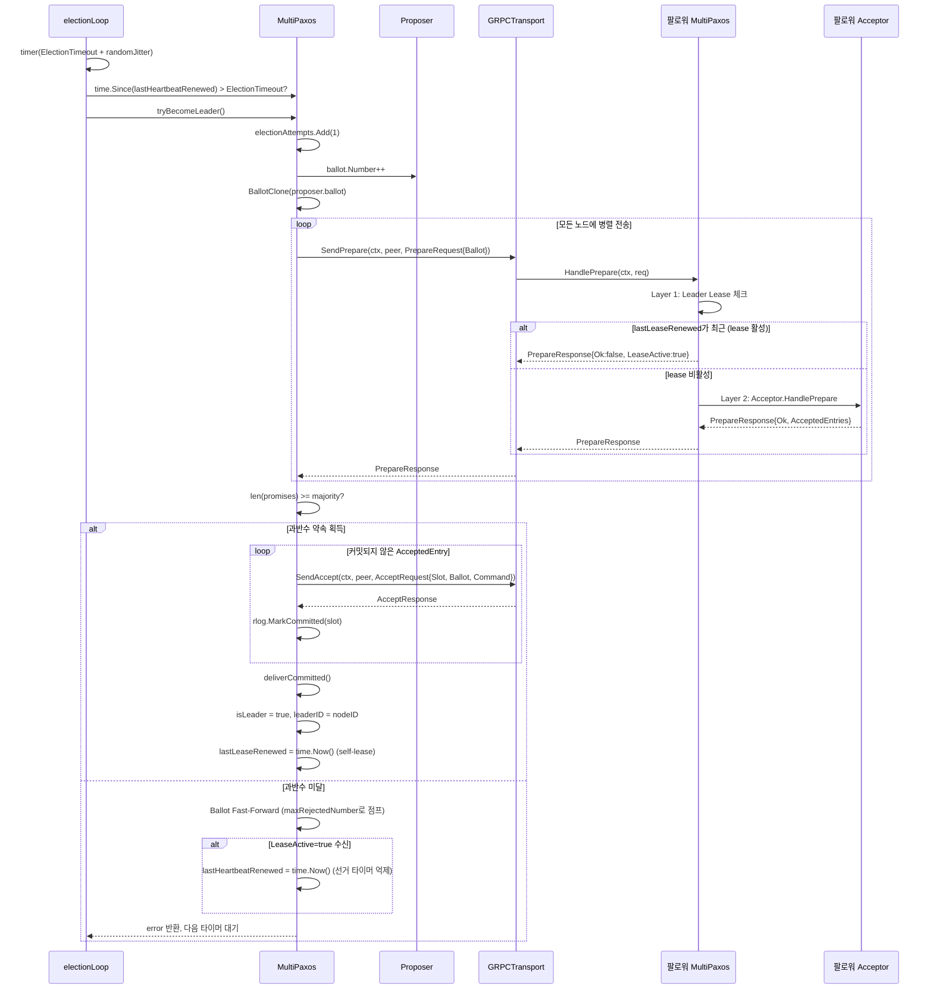
```mermaid
sequenceDiagram
    participant el as electionLoop
    participant mp as MultiPaxos
    participant pr as Proposer
    participant t as GRPCTransport
    participant peer as 팔로워 MultiPaxos
    participant acc as 팔로워 Acceptor

    el->>el: timer(ElectionTimeout + randomJitter)
    el->>mp: time.Since(lastHeartbeatRenewed) > ElectionTimeout?
    el->>mp: tryBecomeLeader()
    mp->>mp: electionAttempts.Add(1)
    mp->>pr: ballot.Number++
    mp->>mp: BallotClone(proposer.ballot)
    loop 모든 노드에 병렬 전송
        mp->>t: SendPrepare(ctx, peer, PrepareRequest{Ballot})
        t->>peer: HandlePrepare(ctx, req)
        peer->>peer: Layer 1: Leader Lease 체크
        alt lastLeaseRenewed가 최근 (lease 활성)
            peer-->>t: PrepareResponse{Ok:false, LeaseActive:true}
        else lease 비활성
            peer->>acc: Layer 2: Acceptor.HandlePrepare
            acc-->>peer: PrepareResponse{Ok, AcceptedEntries}
            peer-->>t: PrepareResponse
        end
        t-->>mp: PrepareResponse
    end
    mp->>mp: len(promises) >= majority?
    alt 과반수 약속 획득
        loop 커밋되지 않은 AcceptedEntry
            mp->>t: SendAccept(ctx, peer, AcceptRequest{Slot, Ballot, Command})
            t-->>mp: AcceptResponse
            mp->>mp: rlog.MarkCommitted(slot)
        end
        mp->>mp: deliverCommitted()
        mp->>mp: isLeader = true, leaderID = nodeID
        mp->>mp: lastLeaseRenewed = time.Now() (self-lease)
    else 과반수 미달
        mp->>mp: Ballot Fast-Forward (maxRejectedNumber로 점프)
        alt LeaseActive=true 수신
            mp->>mp: lastHeartbeatRenewed = time.Now() (선거 타이머 억제)
        end
        mp-->>el: error 반환, 다음 타이머 대기
    end
```

| Step | File:Line | Description |
|------|-----------|-------------|
| 1 | paxos.go:18-22, paxos.go:753-756 | 노드가 시작되면, 각자 선거 타임아웃(500ms) + 랜덤 지연 시간(0~300ms) 동안 대기 한 뒤 리더 선출을 시작한다 |
| 1.1 | paxos.go:18, paxos.go:768-775, paxos.go:798-799 | 리더의 하트비트가 100ms 주기로 전송되므로, 리더가 존재한다면 선거 타임아웃 발생 전에 하트비트를 수신하게 된다. 선거 타임아웃 전에 수신한 하트비트가 있다면, 선거를 다음 타임아웃까지 미룬다 |
| 2 | paxos.go:776-783, paxos.go:571-751 | 수신된 하트비트가 없다면, tryBecomeLeader()를 호출하여 자신을 리더로 제안한다 |
| 2.1 | paxos.go:572 | electionAttempts 카운터를 증가시킨다 (테스트 관찰용) |
| 2.2 | paxos.go:576-580 | 자신의 제안 번호(ballot.Number)를 증가시켜 새로운 제안(ballot)을 생성한다 |
| 2.3 | paxos.go:592-604 | Prepare 요청을 모든 노드에 전송한다 |
| 2.4 | paxos.go:607-624 | 응답을 수집한다. 약속(promise)뿐만 아니라 거부 응답에서 maxRejectedNumber와 LeaseActive 정보도 수집한다 |
| 2.5 | paxos.go:627-690 | 과반수 약속을 받지 못한 경우의 전체 실패 처리 경로이다. 과반수 계산(627-632), 결과 로깅(633-637), 조건 분기(638), Fast-Forward(654-658), Suppression(673-676), 에러 반환(689)을 포함한다 |
| 2.5.1 | paxos.go:654-658 | **Ballot Fast-Forward**: 거부 응답 중 가장 높은 ballot number로 자신의 ballot.Number를 점프시킨다. 다음 시도에서 Number++가 되므로 maxRejectedNumber + 1로 시작한다 |
| 2.5.2 | paxos.go:673-676 | **Election Suppression**: LeaseActive=true인 거부가 있으면 lastHeartbeatRenewed = time.Now()로 설정하여 선거 타이머를 1주기만큼 억제한다 |
| 3 | paxos.go:694-732 | 과반수 약속을 받은 경우, 이전 리더가 Accept를 보냈지만 커밋하지 못한 로그 엔트리가 있다면 새 리더가 다시 제안하여 커밋한다 |
| 3.1 | paxos.go:736-744 | 자신을 리더로 설정하고, lastLeaseRenewed = time.Now()로 self-lease를 설정한다 (리더 자신의 Acceptor도 challenger의 Prepare를 거부하도록) |

### 2-3. Leader Lease 및 선거 최적화

#### lastHeartbeatRenewed vs lastLeaseRenewed

MultiPaxos에는 두 개의 시간 필드가 존재하며, 역할이 다르다.

| 필드 | 용도 | 갱신 시점 |
|------|------|-----------|
| `lastHeartbeatRenewed` | 선거 타이머 억제 (electionLoop에서 사용) | (1) HandleHeartbeat 수신 시, (2) heartbeatLoop에서 리더가 하트비트 전송 후, (3) tryBecomeLeader에서 LeaseActive=true 거부 수신 시 |
| `lastLeaseRenewed` | Acceptor의 leader lease 판단 (HandlePrepare Layer 1에서 사용) | (1) HandleHeartbeat 수신 시, (2) tryBecomeLeader에서 리더 당선 직후 (self-lease), (3) heartbeatLoop에서 리더가 하트비트 전송 후 |

핵심 차이: `lastHeartbeatRenewed`는 거부 응답(LeaseActive=true)에서도 갱신되지만, `lastLeaseRenewed`는 실제 리더 하트비트와 리더 자신의 갱신에서만 갱신된다. 거부 응답은 리더가 살아있다는 직접적 증거가 아니므로, Acceptor의 lease를 연장하면 안 된다.

#### HandlePrepare 2계층 게이트 구조

| Layer | 위치 | 조건 | 역할 |
|-------|------|------|------|
| Layer 1 | paxos.go:389-434 (MultiPaxos) | `time.Since(lastLeaseRenewed) < ElectionTimeout` 이고 `req.Ballot.NodeId != nodeID` | Leader Lease: 리더 하트비트가 최근에 수신된 경우, ballot 값에 관계없이 다른 노드의 Prepare를 거부. `LeaseActive: true`를 응답에 포함. Acceptor의 promisedBallot은 변경하지 않음 |
| Layer 2 | acceptor.go:82-139 (Acceptor) | `BallotGreaterThan(promisedBallot, req.Ballot)` | 표준 Paxos promise: 이미 더 높은 ballot에 promise한 경우 거부. promisedBallot을 갱신하고 수락된 값을 응답에 포함 |

두 게이트를 모두 통과해야 Prepare가 성공한다. Layer 1은 liveness 최적화이며 safety에 영향을 주지 않는다 (Prepare 거부는 항상 안전).

#### Ballot Fast-Forward (paxos.go:654-658)

tryBecomeLeader에서 과반수 약속을 얻지 못했을 때, 거부 응답에서 가장 높은 ballot number(`maxRejectedNumber`)를 수집한다. 실패 시 자신의 `proposer.ballot.Number`를 `maxRejectedNumber`로 설정하여, 다음 시도에서 `Number++`로 `maxRejectedNumber + 1`부터 시작한다.

효과: WAL 복원 후 ballot이 0에서 시작하는 노드가 기존 리더의 ballot까지 1씩 증가하는 대신, 한 번의 실패로 즉시 점프한다.

#### Election Suppression (paxos.go:673-676)

tryBecomeLeader 실패 시 `LeaseActive=true`인 거부가 하나라도 있으면, `lastHeartbeatRenewed = time.Now()`를 설정하여 선거 타이머를 리셋한다.

효과: 리더가 살아있음이 확인된 경우, 1 타이머 주기(ElectionTimeout + jitter, 약 500~800ms)만큼 다음 선거 시도를 지연시킨다. 리더십 탈취 방지의 실질적 보호는 leader lease(Layer 1)가 담당하며, suppression은 불필요한 RPC를 줄이는 최적화 역할이다.

주의사항:
- `leaderID`/`leaderBallot`은 설정하지 않는다 (safety 보호)
- `lastLeaseRenewed`도 갱신하지 않는다 (Acceptor lease 연장 방지)

## 3. 리더: Put 요청 수신(http.go)

### 3-1. 관련 클래스 구조

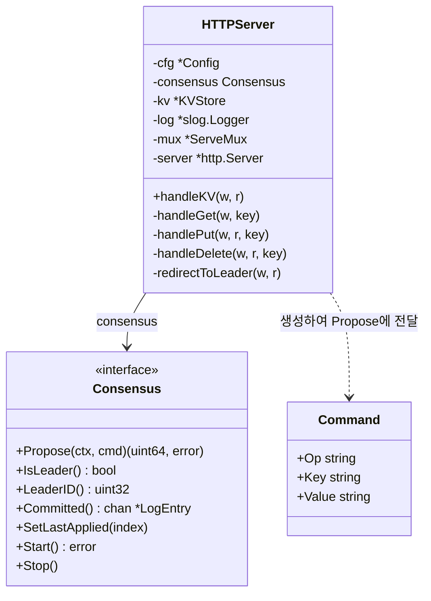
```mermaid
classDiagram
    class HTTPServer {
        -cfg *Config
        -consensus Consensus
        -kv *KVStore
        -log *slog.Logger
        -mux *ServeMux
        -server *http.Server
        +handleKV(w, r)
        -handleGet(w, key)
        -handlePut(w, r, key)
        -handleDelete(w, r, key)
        -redirectToLeader(w, r)
    }
    class Consensus {
        <<interface>>
        +Propose(ctx, cmd) (uint64, error)
        +IsLeader() bool
        +LeaderID() uint32
        +Committed() chan *LogEntry
        +SetLastApplied(index)
        +Start() error
        +Stop()
    }
    class Command {
        +Op string
        +Key string
        +Value string
    }
    HTTPServer --> Consensus : consensus
    HTTPServer ..> Command : 생성하여 Propose에 전달
```

### 3-2. 진행 프로세스

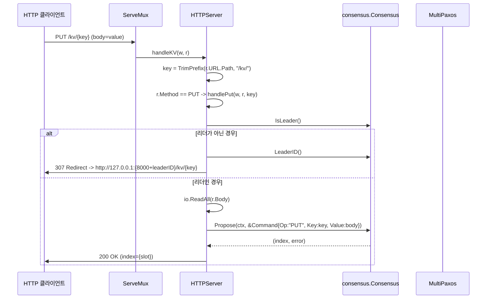
```mermaid
sequenceDiagram
    participant client as HTTP 클라이언트
    participant mux as ServeMux
    participant hs as HTTPServer
    participant c as consensus.Consensus
    participant mp as MultiPaxos

    client->>mux: PUT /kv/{key} (body=value)
    mux->>hs: handleKV(w, r)
    hs->>hs: key = TrimPrefix(r.URL.Path, "/kv/")
    hs->>hs: r.Method == PUT -> handlePut(w, r, key)
    hs->>c: IsLeader()
    alt 리더가 아닌 경우
        hs->>c: LeaderID()
        hs->>client: 307 Redirect -> http://127.0.0.1:{8000+leaderID}/kv/{key}
    else 리더인 경우
        hs->>hs: io.ReadAll(r.Body)
        hs->>c: Propose(ctx, &Command{Op:"PUT", Key:key, Value:body})
        c-->>hs: (index, error)
        hs->>client: 200 OK (index={slot})
    end
```

| Step | File:Line | Description |
|------|-----------|-------------|
| 1 | http.go:37 | s.mux.HandleFunc("/kv/", s.handleKV) |
| 1.1 | http.go:53-70 | "/kv/" 로 시작하는 요청 수신시 handleKV를 호출한다 |
| 2 | http.go:60-69 | handleKV 에서 요청의 Method에 따른 라우팅 |
| 2.1 | http.go:63-64 | Put Method의 경우 handlePut을 호출한다 |
| 3 | http.go:84-110 | 리더 확인 및 합의 과정 시작 |
| 3.1 | http.go:85, paxos.go:295-299 | consensus.IsLeader()를 통해 자신을 실행 중인 노드가 리더인지 확인한다 |
| 3.1.1 | http.go:86-87, http.go:133-148 | 리더가 아니라면, 리더에게 요청을 리다이렉트한다 |
| 3.2 | http.go:99-103, paxos.go:126-247 | 요청받은 pb.Command를 생성하여 consensus.Propose()를 호출하여 합의 과정에 자신의 값을 제안한다 |

## 4. 리더: 합의 제안 및 결과 수신(paxos.go)

### 4-1. 관련 클래스 구조

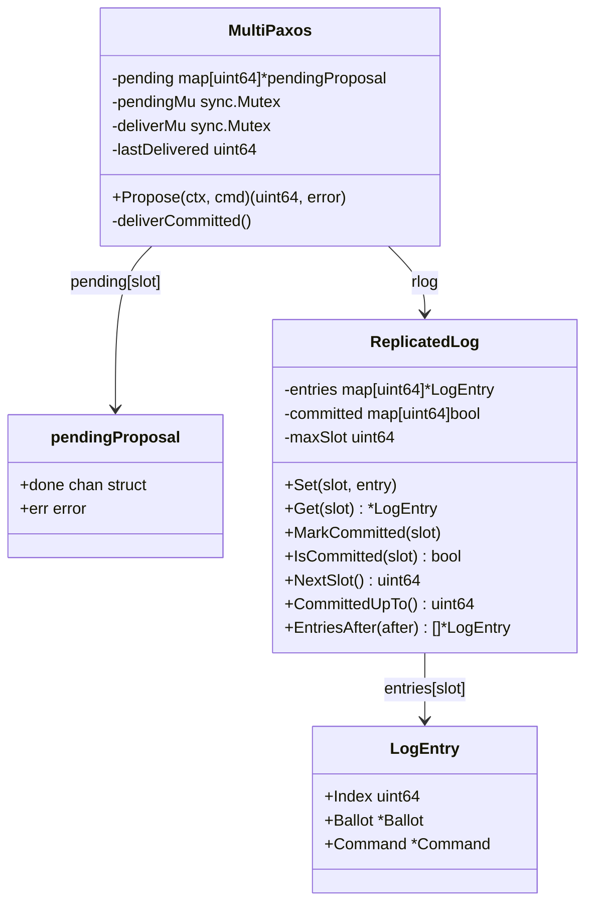
```mermaid
classDiagram
    class MultiPaxos {
        -pending map[uint64]*pendingProposal
        -pendingMu sync.Mutex
        -deliverMu sync.Mutex
        -lastDelivered uint64
        +Propose(ctx, cmd) (uint64, error)
        -deliverCommitted()
    }
    class pendingProposal {
        +done chan struct
        +err error
    }
    class ReplicatedLog {
        -entries map[uint64]*LogEntry
        -committed map[uint64]bool
        -maxSlot uint64
        +Set(slot, entry)
        +Get(slot) *LogEntry
        +MarkCommitted(slot)
        +IsCommitted(slot) bool
        +NextSlot() uint64
        +CommittedUpTo() uint64
        +EntriesAfter(after) []*LogEntry
    }
    class LogEntry {
        +Index uint64
        +Ballot *Ballot
        +Command *Command
    }
    MultiPaxos --> pendingProposal : pending[slot]
    MultiPaxos --> ReplicatedLog : rlog
    ReplicatedLog --> LogEntry : entries[slot]
```

### 4-2. 진행 프로세스

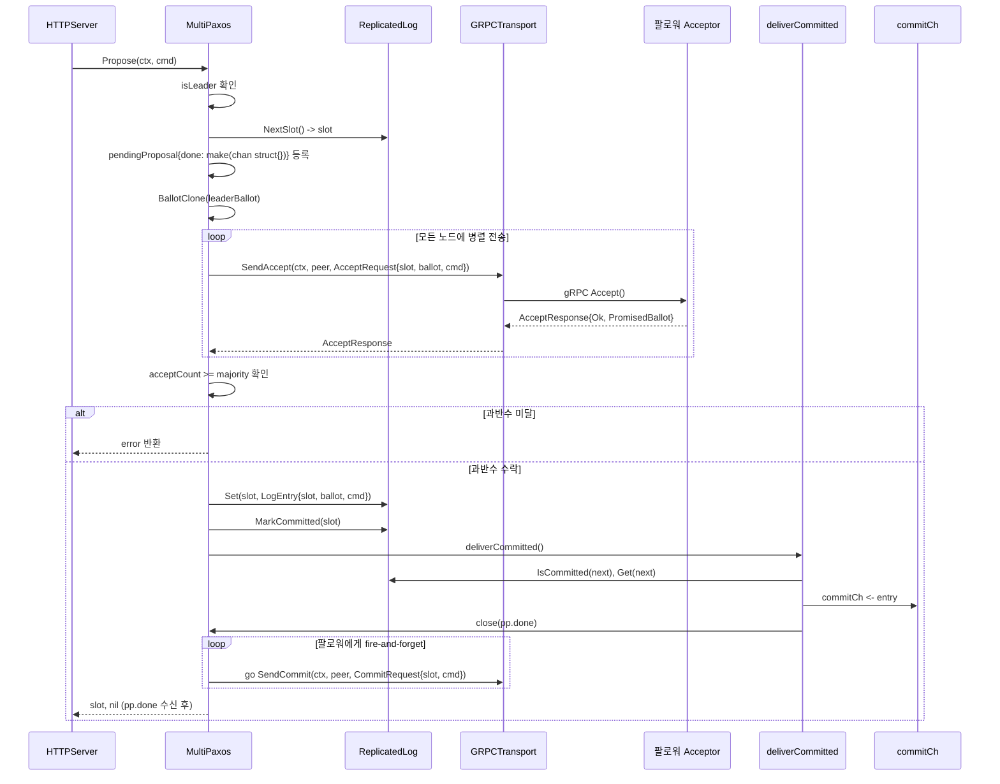
```mermaid
sequenceDiagram
    participant hs as HTTPServer
    participant mp as MultiPaxos
    participant rl as ReplicatedLog
    participant t as GRPCTransport
    participant acc as 팔로워 Acceptor
    participant dc as deliverCommitted
    participant ch as commitCh

    hs->>mp: Propose(ctx, cmd)
    mp->>mp: isLeader 확인
    mp->>rl: NextSlot() -> slot
    mp->>mp: pendingProposal{done: make(chan struct{})} 등록
    mp->>mp: BallotClone(leaderBallot)
    loop 모든 노드에 병렬 전송
        mp->>t: SendAccept(ctx, peer, AcceptRequest{slot, ballot, cmd})
        t->>acc: gRPC Accept()
        acc-->>t: AcceptResponse{Ok, PromisedBallot}
        t-->>mp: AcceptResponse
    end
    mp->>mp: acceptCount >= majority 확인
    alt 과반수 미달
        mp-->>hs: error 반환
    else 과반수 수락
        mp->>rl: Set(slot, LogEntry{slot, ballot, cmd})
        mp->>rl: MarkCommitted(slot)
        mp->>dc: deliverCommitted()
        dc->>rl: IsCommitted(next), Get(next)
        dc->>ch: commitCh <- entry
        dc->>mp: close(pp.done)
        loop 팔로워에게 fire-and-forget
            mp->>t: go SendCommit(ctx, peer, CommitRequest{slot, cmd})
        end
        mp-->>hs: slot, nil (pp.done 수신 후)
    end
```

> 리더가 선출되는 과정에서 Propose를 거쳤으므로 유효한 제안 값(leaderBallot)을 이미 가지고 있다. 따라서 리더는 Propose를 생략하고 Accept를 요청한다.

| Step | File:Line | Description |
|------|-----------|-------------|
| 1 | paxos.go:127-134 | 리더가 아니라면 바로 종료한다 |
| 2 | paxos.go:137, log.go:72-77 | rlog.NextSlot()으로 이번에 처리할 슬롯 번호를 가져온다 |
| 3 | paxos.go:140-143 | 커밋이 종료될 때 까지 대기하기 위해 pendingProposal 타입의 pp를 생성한다 |
| 3.1 | paxos.go:242, paxos.go:274 | 커밋 종료 후 close(pp.done)를 호출하면, "case <-pp.done:" 에서 대기하던 고루틴이 재개된다 |
| 4 | paxos.go:152-154 | 리더 노드의 제안 값(leaderBallot)을 복제해둔다 |
| 5 | paxos.go:171-195 | transport 인터페이스의 SendAccept를 호출하여 자신을 포함한 모든 노드에 Accept 요청을 전송한다 |
| 5.1 | grpc.go:81-87 | 여기서는 grpcTransport.SendAccept() -> gRPCClient.Accept() 가 호출된다 |
| 5.2 | paxos.go:183-191 | 이 과정에서 리더 노드의 leaderBallot 보다 더 높은 ballot이 수신되면, 해당 노드는 즉시 리더에서 물러난다 |
| 6 | paxos.go:198-203 | 모든 요청의 응답이 도착하면, 수락된 횟수를 카운트 하여 과반수를 확인한다 |
| 6.1 | paxos.go:211-213 | 과반수 미달시 즉시 실패 리턴 |
| 7 | paxos.go:216-218, log.go:23-31, log.go:40-45 | 과반수가 수락한 값을 리더의 rlog에 저장하고, 커밋으로 표시한다 |
| 8 | paxos.go:221, paxos.go:250-282 | deliverCommitted를 호출하여 연속적으로 커밋된 엔트리 목록을 commitCh에 전달한다 |
| 8.1 | paxos.go:256-265 | 3번, 5번이 커밋되었다면, 순서 보장을 위해서 3번을 전달하고 4번이 커밋될때까지 기다린다 |
| 8.2 | paxos.go:268-276 | commitCh에 커밋된 엔트리를 전달 후, close(pp.done)을 호출하여 커밋을 대기중인 고루틴이 재개되도록 한다 |
| 9 | paxos.go:223-238 | 자신을 제외한 팔로워 노드에 커밋 정보를 전달한다 |
| 9.1 | paxos.go:231-237, paxos.go:334-385 | 팔로워가 받지 못해도 무시한다. 받지못한 경우 catchupLoop를 통해 리더에게 요청하여 처리하게 된다 |

## 5. 팔로워: 리더의 Accept 요청 수신(grpc_server.go -> paxos.go -> acceptor.go)

### 5-1. 관련 클래스 구조

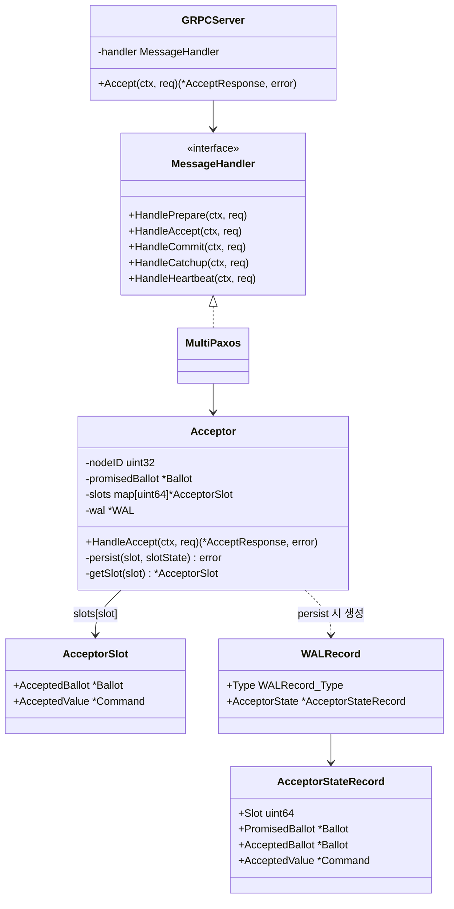
```mermaid
classDiagram
    class GRPCServer {
        -handler MessageHandler
        +Accept(ctx, req) (*AcceptResponse, error)
    }
    class MessageHandler {
        <<interface>>
        +HandlePrepare(ctx, req)
        +HandleAccept(ctx, req)
        +HandleCommit(ctx, req)
        +HandleCatchup(ctx, req)
        +HandleHeartbeat(ctx, req)
    }
    class Acceptor {
        -nodeID uint32
        -promisedBallot *Ballot
        -slots map[uint64]*AcceptorSlot
        -wal *WAL
        +HandleAccept(ctx, req) (*AcceptResponse, error)
        -persist(slot, slotState) error
        -getSlot(slot) *AcceptorSlot
    }
    class AcceptorSlot {
        +AcceptedBallot *Ballot
        +AcceptedValue *Command
    }
    class WALRecord {
        +Type WALRecord_Type
        +AcceptorState *AcceptorStateRecord
    }
    class AcceptorStateRecord {
        +Slot uint64
        +PromisedBallot *Ballot
        +AcceptedBallot *Ballot
        +AcceptedValue *Command
    }
    GRPCServer --> MessageHandler
    MessageHandler <|.. MultiPaxos
    MultiPaxos --> Acceptor
    Acceptor --> AcceptorSlot : slots[slot]
    Acceptor ..> WALRecord : persist 시 생성
    WALRecord --> AcceptorStateRecord
```

### 5-2. 진행 프로세스

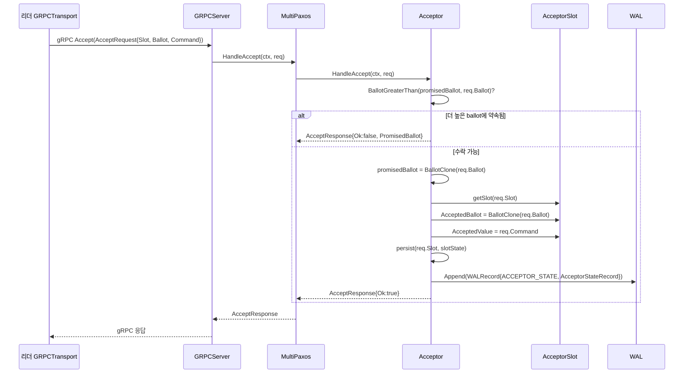
```mermaid
sequenceDiagram
    participant leader as 리더 GRPCTransport
    participant gs as GRPCServer
    participant mp as MultiPaxos
    participant acc as Acceptor
    participant slot as AcceptorSlot
    participant w as WAL

    leader->>gs: gRPC Accept(AcceptRequest{Slot, Ballot, Command})
    gs->>mp: HandleAccept(ctx, req)
    mp->>acc: HandleAccept(ctx, req)
    acc->>acc: BallotGreaterThan(promisedBallot, req.Ballot)?
    alt 더 높은 ballot에 약속됨
        acc-->>mp: AcceptResponse{Ok:false, PromisedBallot}
    else 수락 가능
        acc->>acc: promisedBallot = BallotClone(req.Ballot)
        acc->>slot: getSlot(req.Slot)
        acc->>slot: AcceptedBallot = BallotClone(req.Ballot)
        acc->>slot: AcceptedValue = req.Command
        acc->>acc: persist(req.Slot, slotState)
        acc->>w: Append(WALRecord{ACCEPTOR_STATE, AcceptorStateRecord})
        acc-->>mp: AcceptResponse{Ok:true}
    end
    mp-->>gs: AcceptResponse
    gs-->>leader: gRPC 응답
```

| Step | File:Line | Description |
|------|-----------|-------------|
| 1 | grpc_server.go:49-51, paxos.go:442-444 | grpcServer가 리더의 Accept요청을 수신하고, 메세지 핸들러(MultiPaxos)의 HandleAccept를 호출한다 |
| 2 | paxos.go:443, acceptor.go:141-176 | MultiPaxos.HandleAccept -> acceptor.HandleAccept를 호출한다 |
| 2.1 | acceptor.go:149-158 | 이미 더 높은 ballot에 수락을 약속했다면, 거절한다. -> 리더가 자신이 보낸 Accept 요청에 대한 응답으로 수집한다 |
| 2.2 | acceptor.go:161-164 | 수락을 약속할 ballot, 수락한 ballot, 수락한 값으로 상태를 업데이트한다 |
| 2.3 | acceptor.go:167-169, acceptor.go:61-79 | 슬롯의 상태를 WAL에 기록한다 |
| 2.4 | acceptor.go:175 | 수락을 약속함을 리턴한다. -> 리더가 자신이 보낸 Accept 요청에 대한 응답으로 수집한다 |

## 6. 팔로워: 리더의 Commit 수신(paxos.go)

### 6-1. 관련 클래스 구조

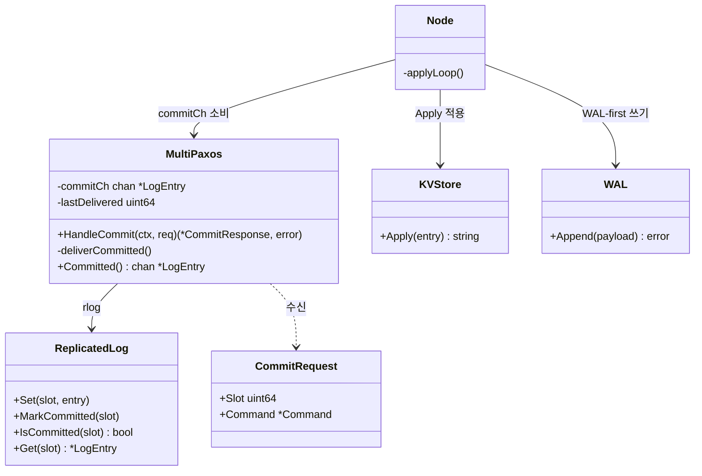
```mermaid
classDiagram
    class CommitRequest {
        +Slot uint64
        +Command *Command
    }
    class MultiPaxos {
        -commitCh chan *LogEntry
        -lastDelivered uint64
        +HandleCommit(ctx, req) (*CommitResponse, error)
        -deliverCommitted()
        +Committed() chan *LogEntry
    }
    class ReplicatedLog {
        +Set(slot, entry)
        +MarkCommitted(slot)
        +IsCommitted(slot) bool
        +Get(slot) *LogEntry
    }
    class Node {
        -applyLoop()
    }
    class KVStore {
        +Apply(entry) string
    }
    class WAL {
        +Append(payload) error
    }
    MultiPaxos --> ReplicatedLog : rlog
    MultiPaxos ..> CommitRequest : 수신
    Node --> MultiPaxos : commitCh 소비
    Node --> WAL : WAL-first 쓰기
    Node --> KVStore : Apply 적용
```

### 6-2. 진행 프로세스

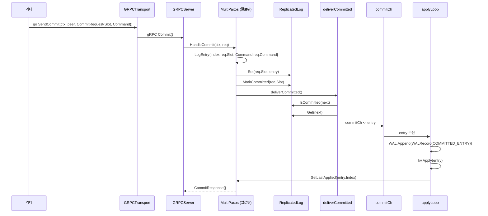
```mermaid
sequenceDiagram
    participant leader as 리더
    participant t as GRPCTransport
    participant gs as GRPCServer
    participant mp as MultiPaxos (팔로워)
    participant rl as ReplicatedLog
    participant dc as deliverCommitted
    participant ch as commitCh
    participant al as applyLoop

    leader->>t: go SendCommit(ctx, peer, CommitRequest{Slot, Command})
    t->>gs: gRPC Commit()
    gs->>mp: HandleCommit(ctx, req)
    mp->>mp: LogEntry{Index:req.Slot, Command:req.Command}
    mp->>rl: Set(req.Slot, entry)
    mp->>rl: MarkCommitted(req.Slot)
    mp->>dc: deliverCommitted()
    dc->>rl: IsCommitted(next)
    dc->>rl: Get(next)
    dc->>ch: commitCh <- entry
    ch->>al: entry 수신
    al->>al: WAL.Append(WALRecord{COMMITTED_ENTRY})
    al->>al: kv.Apply(entry)
    al->>mp: SetLastApplied(entry.Index)
    mp-->>gs: CommitResponse{}
```

| Step | File:Line | Description |
|------|-----------|-------------|
| 1 | paxos.go:223-238 | 리더가 과반수 수락을 받은 후, 자신을 제외한 팔로워에게 CommitRequest(Slot + Command)를 전송한다 (fire-and-forget) |
| 2 | paxos.go:447-457 | 팔로워의 HandleCommit 처리 |
| 2.1 | paxos.go:452 | CommitRequest의 Slot과 Command로 LogEntry를 생성한다. (Ballot은 전달되지 않음 -- 팔로워는 리더의 ballot을 알 필요가 없다.) |
| 2.2 | paxos.go:453, log.go:23-31 | rlog.Set(slot, entry)로 로그에 저장한다 |
| 2.3 | paxos.go:454, log.go:40-45 | rlog.MarkCommitted(slot)로 커밋 표시한다 |
| 2.4 | paxos.go:455, paxos.go:250-282 | deliverCommitted()를 호출하여 연속적으로 커밋된 엔트리를 commitCh에 전달한다 |
| 3 | node.go:159-189 | commitCh에 전달된 엔트리는 applyLoop가 수신하여 WAL 기록 후 KVStore에 적용한다 |
| 4 | | 팔로워가 이 CommitRequest를 놓친 경우: |
| 4.1 | paxos.go:524-536 | 하트비트의 CommittedUpTo를 통해 커밋이 보충된다 |
| 4.2 | paxos.go:334-385 | 그래도 로그 엔트리 자체가 없다면, catchupLoop를 통해 리더에게 엔트리를 요청한다 |

## 7. 팔로워: 하트비트 수신 처리(paxos.go)

### 7-1. 관련 클래스 구조

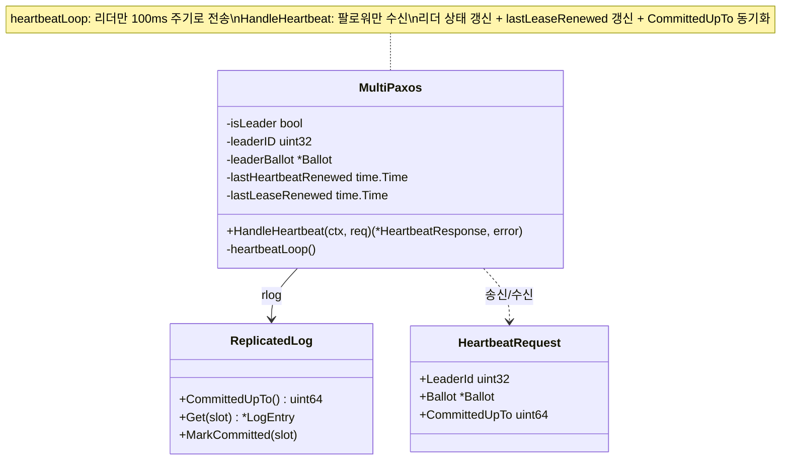
```mermaid
classDiagram
    class HeartbeatRequest {
        +LeaderId uint32
        +Ballot *Ballot
        +CommittedUpTo uint64
    }
    class MultiPaxos {
        -isLeader bool
        -leaderID uint32
        -leaderBallot *Ballot
        -lastHeartbeatRenewed time.Time
        -lastLeaseRenewed time.Time
        +HandleHeartbeat(ctx, req) (*HeartbeatResponse, error)
        -heartbeatLoop()
    }
    class ReplicatedLog {
        +CommittedUpTo() uint64
        +Get(slot) *LogEntry
        +MarkCommitted(slot)
    }
    note for MultiPaxos "heartbeatLoop: 리더만 100ms 주기로 전송\nHandleHeartbeat: 팔로워만 수신\n리더 상태 갱신 + lastLeaseRenewed 갱신 + CommittedUpTo 동기화"
    MultiPaxos --> ReplicatedLog : rlog
    MultiPaxos ..> HeartbeatRequest : 송신/수신
```

### 7-2. 진행 프로세스

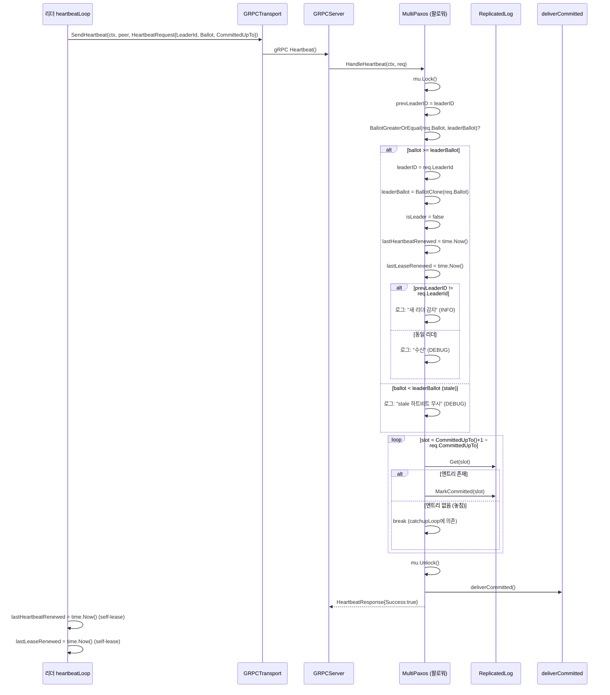
```mermaid
sequenceDiagram
    participant leader as 리더 heartbeatLoop
    participant t as GRPCTransport
    participant gs as GRPCServer
    participant mp as MultiPaxos (팔로워)
    participant rl as ReplicatedLog
    participant dc as deliverCommitted

    leader->>t: SendHeartbeat(ctx, peer, HeartbeatRequest{LeaderId, Ballot, CommittedUpTo})
    t->>gs: gRPC Heartbeat()
    gs->>mp: HandleHeartbeat(ctx, req)
    mp->>mp: mu.Lock()
    mp->>mp: prevLeaderID = leaderID
    mp->>mp: BallotGreaterOrEqual(req.Ballot, leaderBallot)?
    alt ballot >= leaderBallot
        mp->>mp: leaderID = req.LeaderId
        mp->>mp: leaderBallot = BallotClone(req.Ballot)
        mp->>mp: isLeader = false
        mp->>mp: lastHeartbeatRenewed = time.Now()
        mp->>mp: lastLeaseRenewed = time.Now()
        alt prevLeaderID != req.LeaderId
            mp->>mp: 로그: "새 리더 감지" (INFO)
        else 동일 리더
            mp->>mp: 로그: "수신" (DEBUG)
        end
    else ballot < leaderBallot (stale)
        mp->>mp: 로그: "stale 하트비트 무시" (DEBUG)
    end
    loop slot = CommittedUpTo()+1 ~ req.CommittedUpTo
        mp->>rl: Get(slot)
        alt 엔트리 존재
            mp->>rl: MarkCommitted(slot)
        else 엔트리 없음 (놓침)
            mp->>mp: break (catchupLoop에 의존)
        end
    end
    mp->>mp: mu.Unlock()
    mp->>dc: deliverCommitted()
    mp-->>gs: HeartbeatResponse{Success:true}
    leader->>leader: lastHeartbeatRenewed = time.Now() (self-lease)
    leader->>leader: lastLeaseRenewed = time.Now() (self-lease)
```

| Step | File:Line | Description |
|------|-----------|-------------|
| 1 | paxos.go:469-568 | HandleHeartbeat는 단순한 ping이 아니라, 리더 상태 갱신과 커밋 동기화를 함께 수행한다 |
| 2 | paxos.go:483-517 | 리더 상태 갱신 |
| 2.1 | paxos.go:485 | prevLeaderID를 캡처하여 리더 변경 여부를 감지한다 |
| 2.2 | paxos.go:488 | BallotGreaterOrEqual로 비교하므로, 같은 ballot의 반복 하트비트도 정상적으로 처리한다 |
| 2.3 | paxos.go:489-490 | leaderID, leaderBallot을 업데이트한다 |
| 2.4 | paxos.go:491 | isLeader = false로 설정한다. (팔로워만 하트비트를 수신하므로) |
| 2.5 | paxos.go:492 | lastHeartbeatRenewed = time.Now()로 선거 타이머를 리셋한다 |
| 2.6 | paxos.go:496 | lastLeaseRenewed = time.Now()로 leader lease를 갱신한다. 이 값은 HandlePrepare의 Layer 1에서 challenger의 Prepare를 거부할 때 사용된다 |
| 2.7 | paxos.go:499-510 | 로그 값을 캡처한다: prevLeaderID와 비교하여 새 리더 감지(INFO) 또는 루틴 하트비트(DEBUG)를 구분한다 |
| 2.8 | paxos.go:511-517 | stale 하트비트(ballot < leaderBallot)는 리더 상태를 갱신하지 않는다 |
| 3 | paxos.go:522-542, log.go:58-69 | CommittedUpTo 처리 (ballot 비교 결과와 무관하게 항상 실행) |
| 3.1 | paxos.go:524 | 자신의 rlog.CommittedUpTo()+1 부터 리더의 CommittedUpTo까지 순회한다 |
| 3.2 | paxos.go:525-527 | rlog.Get(slot)이 nil이 아닌 경우: rlog.MarkCommitted(slot)로 커밋 처리한다 |
| 3.3 | paxos.go:528-535 | rlog.Get(slot)이 nil인 경우: 놓친 엔트리가 존재하므로 break하고, catchupLoop에 의존한다 |
| 4 | paxos.go:544, paxos.go:565 | mu.Unlock() 후 deliverCommitted()를 호출하여 commitCh에 전달한다 |

## 8. 팔로워: Catchup 루프(paxos.go)

### 8-1. 관련 클래스 구조

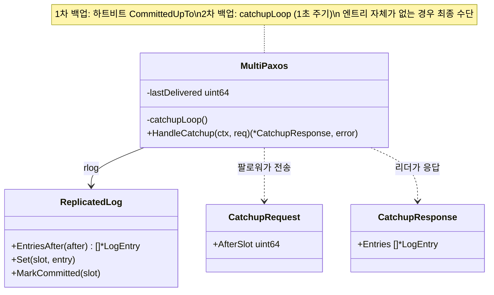
```mermaid
classDiagram
    class CatchupRequest {
        +AfterSlot uint64
    }
    class CatchupResponse {
        +Entries []*LogEntry
    }
    class MultiPaxos {
        -lastDelivered uint64
        -catchupLoop()
        +HandleCatchup(ctx, req) (*CatchupResponse, error)
    }
    class ReplicatedLog {
        +EntriesAfter(after) []*LogEntry
        +Set(slot, entry)
        +MarkCommitted(slot)
    }
    note for MultiPaxos "1차 백업: 하트비트 CommittedUpTo\n2차 백업: catchupLoop (1초 주기)\n 엔트리 자체가 없는 경우 최종 수단"
    MultiPaxos --> ReplicatedLog : rlog
    MultiPaxos ..> CatchupRequest : 팔로워가 전송
    MultiPaxos ..> CatchupResponse : 리더가 응답
```

### 8-2. 진행 프로세스

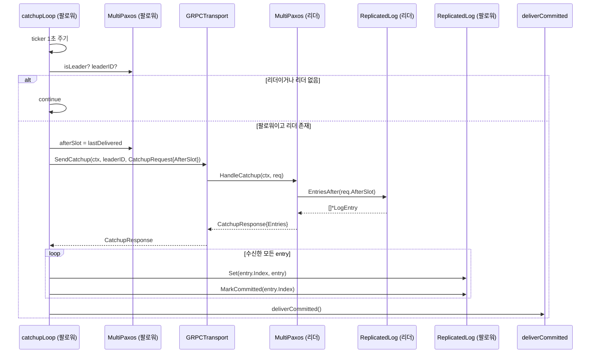
```mermaid
sequenceDiagram
    participant cl as catchupLoop (팔로워)
    participant mp as MultiPaxos (팔로워)
    participant t as GRPCTransport
    participant lmp as MultiPaxos (리더)
    participant rl_l as ReplicatedLog (리더)
    participant rl_f as ReplicatedLog (팔로워)
    participant dc as deliverCommitted

    cl->>cl: ticker 1초 주기
    cl->>mp: isLeader? leaderID?
    alt 리더이거나 리더 없음
        cl->>cl: continue
    else 팔로워이고 리더 존재
        cl->>mp: afterSlot = lastDelivered
        cl->>t: SendCatchup(ctx, leaderID, CatchupRequest{AfterSlot})
        t->>lmp: HandleCatchup(ctx, req)
        lmp->>rl_l: EntriesAfter(req.AfterSlot)
        rl_l-->>lmp: []*LogEntry
        lmp-->>t: CatchupResponse{Entries}
        t-->>cl: CatchupResponse
        loop 수신한 모든 entry
            cl->>rl_f: Set(entry.Index, entry)
            cl->>rl_f: MarkCommitted(entry.Index)
        end
        cl->>dc: deliverCommitted()
    end
```

| Step | File:Line | Description |
|------|-----------|-------------|
| 1 | paxos.go:335 | 1초 주기로 동작하는 백업 메커니즘이다. (하트비트 100ms보다 느리게 설정) |
| 2 | paxos.go:343-350 | 실행 조건: 자신이 리더가 아니고, 리더가 존재하는 경우에만 동작한다 |
| 3 | | 동작 흐름: |
| 3.1 | paxos.go:352-354 | lastDelivered(마지막으로 commitCh에 전달한 슬롯 번호)를 afterSlot으로 설정한다 |
| 3.2 | paxos.go:356-359 | 리더에게 SendCatchup(CatchupRequest{AfterSlot: afterSlot})을 전송한다 |
| 3.3 | paxos.go:460-466, log.go:80-93 | 리더의 HandleCatchup은 rlog.EntriesAfter(afterSlot)으로 해당 슬롯 이후의 모든 엔트리를 응답한다 |
| 3.4 | paxos.go:377-382 | 팔로워는 받은 엔트리를 rlog.Set + rlog.MarkCommitted 후 deliverCommitted()를 호출한다 |
| 4 | | 최종 백업 역할: |
| 4.1 | paxos.go:524-536 | CommitRequest를 놓친 경우의 1차 백업: 하트비트의 CommittedUpTo |
| 4.2 | paxos.go:334-385 | 하트비트의 CommittedUpTo로도 처리할 수 없는 경우(로그 엔트리 자체가 없는 경우): catchupLoop가 최종 백업 |

## 9. applyLoop: WAL-first 쓰기(node.go)

### 9-1. 관련 클래스 구조

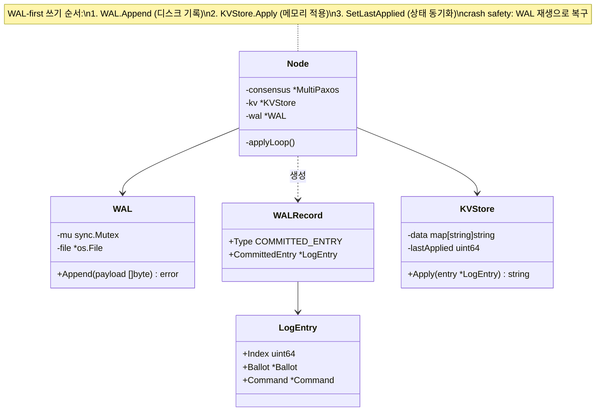
```mermaid
classDiagram
    class Node {
        -consensus *MultiPaxos
        -kv *KVStore
        -wal *WAL
        -applyLoop()
    }
    class WAL {
        -mu sync.Mutex
        -file *os.File
        +Append(payload []byte) error
    }
    class WALRecord {
        +Type COMMITTED_ENTRY
        +CommittedEntry *LogEntry
    }
    class KVStore {
        -data map[string]string
        -lastApplied uint64
        +Apply(entry *LogEntry) string
    }
    class LogEntry {
        +Index uint64
        +Ballot *Ballot
        +Command *Command
    }
    note for Node "WAL-first 쓰기 순서:\n1. WAL.Append (디스크 기록)\n2. KVStore.Apply (메모리 적용)\n3. SetLastApplied (상태 동기화)\ncrash safety: WAL 재생으로 복구"
    Node --> WAL
    Node --> KVStore
    Node ..> WALRecord : 생성
    WALRecord --> LogEntry
```

### 9-2. 진행 프로세스

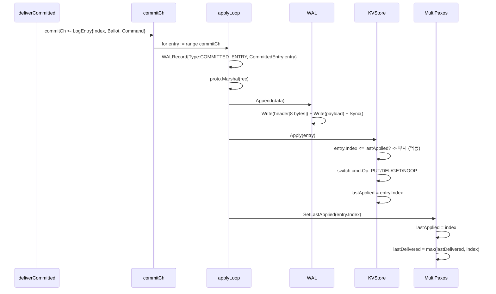
```mermaid
sequenceDiagram
    participant dc as deliverCommitted
    participant ch as commitCh
    participant al as applyLoop
    participant w as WAL
    participant kv as KVStore
    participant mp as MultiPaxos

    dc->>ch: commitCh <- LogEntry{Index, Ballot, Command}
    ch->>al: for entry := range commitCh
    al->>al: WALRecord{Type:COMMITTED_ENTRY, CommittedEntry:entry}
    al->>al: proto.Marshal(rec)
    al->>w: Append(data)
    w->>w: Write(header[8 bytes]) + Write(payload) + Sync()
    al->>kv: Apply(entry)
    kv->>kv: entry.Index <= lastApplied? -> 무시 (멱등)
    kv->>kv: switch cmd.Op: PUT/DEL/GET/NOOP
    kv->>kv: lastApplied = entry.Index
    al->>mp: SetLastApplied(entry.Index)
    mp->>mp: lastApplied = index
    mp->>mp: lastDelivered = max(lastDelivered, index)
```

| Step | File:Line | Description |
|------|-----------|-------------|
| 1 | node.go:163, paxos.go:285-287 | consensus.Committed() 채널(commitCh)에서 커밋된 엔트리를 수신하는 유일한 소비자이다 |
| 2 | | WAL-first 쓰기 순서: |
| 2.1 | node.go:165-177, wal.go:46-64 | 커밋된 엔트리를 WALRecord(Type=COMMITTED_ENTRY)로 직렬화하여 WAL에 먼저 기록한다 |
| 2.2 | node.go:184, kvstore.go:25-49 | WAL 기록이 성공한 후, kv.Apply(entry)로 KVStore에 적용한다 |
| 2.3 | node.go:187, paxos.go:302-313 | consensus.SetLastApplied(entry.Index)를 호출하여 lastApplied와 lastDelivered를 동기화한다 |
| 3 | | crash safety: |
| 3.1 | node.go:93-122 | WAL에 기록됐지만 KVStore에 적용되기 전에 크래시가 발생하면, 복구 시 WAL 재생을 통해 해당 엔트리가 KVStore에 다시 적용된다 |
| 3.2 | kvstore.go:29-31 | KVStore에 적용됐지만 SetLastApplied 전에 크래시가 발생해도, WAL 재생 시 동일 엔트리가 다시 적용되므로 안전하다. (KVStore.Apply는 멱등) |

## 10. snapshotLoop: 스냅샷 생성(node.go)

### 10-1. 관련 클래스 구조

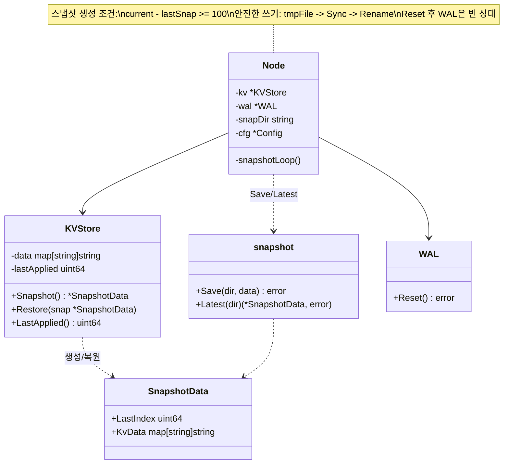
```mermaid
classDiagram
    class Node {
        -kv *KVStore
        -wal *WAL
        -snapDir string
        -cfg *Config
        -snapshotLoop()
    }
    class KVStore {
        -data map[string]string
        -lastApplied uint64
        +Snapshot() *SnapshotData
        +Restore(snap *SnapshotData)
        +LastApplied() uint64
    }
    class SnapshotData {
        +LastIndex uint64
        +KvData map[string]string
    }
    class snapshot {
        +Save(dir, data) error
        +Latest(dir) (*SnapshotData, error)
    }
    class WAL {
        +Reset() error
    }
    note for Node "스냅샷 생성 조건:\ncurrent - lastSnap >= 100\n안전한 쓰기: tmpFile -> Sync -> Rename\nReset 후 WAL은 빈 상태"
    Node --> KVStore
    Node --> WAL
    Node ..> snapshot : Save/Latest
    KVStore ..> SnapshotData : 생성/복원
    snapshot ..> SnapshotData
```

### 10-2. 진행 프로세스

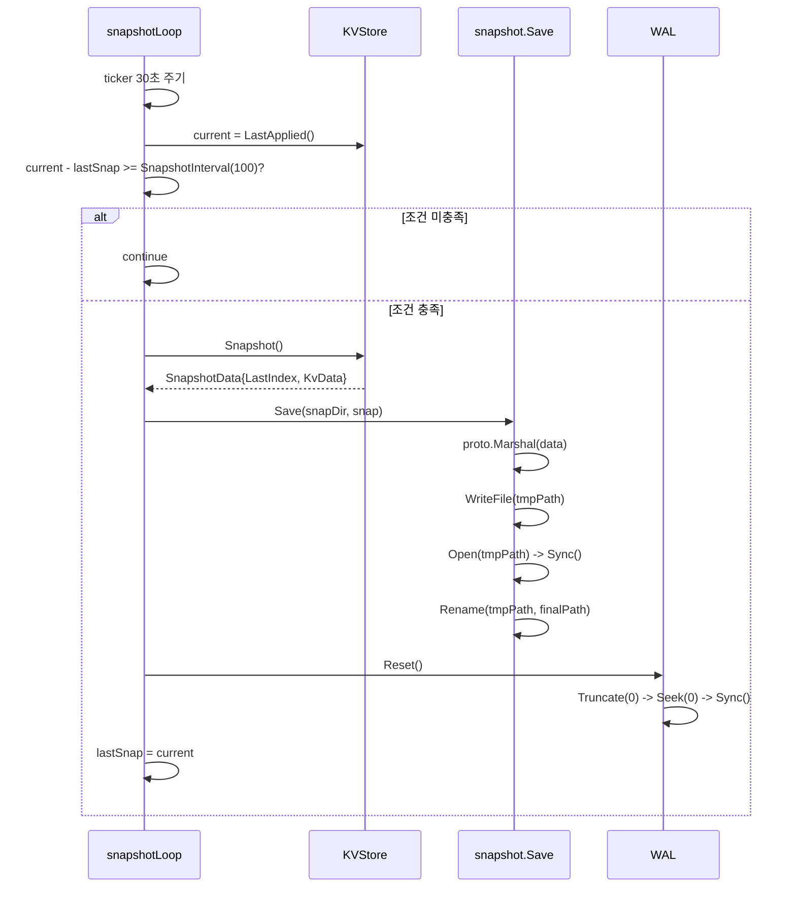
```mermaid
sequenceDiagram
    participant sl as snapshotLoop
    participant kv as KVStore
    participant ss as snapshot.Save
    participant w as WAL

    sl->>sl: ticker 30초 주기
    sl->>kv: current = LastApplied()
    sl->>sl: current - lastSnap >= SnapshotInterval(100)?
    alt 조건 미충족
        sl->>sl: continue
    else 조건 충족
        sl->>kv: Snapshot()
        kv-->>sl: SnapshotData{LastIndex, KvData}
        sl->>ss: Save(snapDir, snap)
        ss->>ss: proto.Marshal(data)
        ss->>ss: WriteFile(tmpPath)
        ss->>ss: Open(tmpPath) -> Sync()
        ss->>ss: Rename(tmpPath, finalPath)
        sl->>w: Reset()
        w->>w: Truncate(0) -> Seek(0) -> Sync()
        sl->>sl: lastSnap = current
    end
```

| Step | File:Line | Description |
|------|-----------|-------------|
| 1 | node.go:193 | 30초 주기로 스냅샷 생성 조건을 확인한다 |
| 2 | node.go:198-199, config.go:17, config.go:34 | 생성 조건: kv.LastApplied() - lastSnapshotIndex >= config.SnapshotInterval (기본값 100). 이전 스냅샷 이후 100개 이상의 엔트리가 적용된 경우에만 스냅샷을 생성한다 |
| 3 | | 스냅샷 생성 흐름: |
| 3.1 | node.go:200, kvstore.go:61-74 | kv.Snapshot()으로 현재 KVStore의 전체 상태를 SnapshotData로 추출한다 |
| 3.2 | node.go:201, snapshot.go:16-47 | snapshot.Save(snapDir, snap)로 스냅샷 파일을 디스크에 저장한다 |
| 3.2.1 | snapshot.go:27-46 | 임시 파일 생성 -> Sync() -> Rename()의 안전한 쓰기 패턴을 사용한다 |
| 3.3 | node.go:205, wal.go:115-126 | wal.Reset()으로 WAL 파일을 비운다. (Truncate(0) -> Seek(0) -> Sync()). 스냅샷에 모든 상태가 포함되었으므로, WAL 파일의 이전 기록은 더 이상 필요하지 않다 |
| 4 | node.go:77-122 | 복구 시 동작: 스냅샷으로 KVStore의 기본 상태를 복원한 후, 스냅샷 이후에 기록된 WAL 엔트리만 재생한다. WAL Reset 이후에 기록된 엔트리만 WAL 파일에 존재하므로, 자연스럽게 스냅샷 이후 엔트리만 재생된다 |

## 11. 리더: Get, Delete 요청 처리(http.go)

### 11-1. 관련 클래스 구조

```mermaid
classDiagram
    class HTTPServer {
        -cfg *Config
        -consensus Consensus
        -kv *KVStore
        +handleGet(w, key)
        +handleDelete(w, r, key)
        -redirectToLeader(w, r)
    }
    class KVStore {
        -data map[string]string
        +Get(key) (string, bool)
    }
    class Consensus {
        <<interface>>
        +Propose(ctx, cmd) (uint64, error)
        +IsLeader() bool
        +LeaderID() uint32
    }
    class Command {
        +Op string
        +Key string
        +Value string
    }
    note for HTTPServer "GET: 로컬 KVStore에서 직접 읽기 (stale read)\n합의 불필요, 모든 노드에서 처리 가능\nDELETE: PUT과 동일한 흐름\nOp='DEL', Value 없음"
    HTTPServer --> KVStore : 직접 읽기 (GET)
    HTTPServer --> Consensus : 합의 (DELETE)
    HTTPServer ..> Command : Op="DEL"
```

### 11-2. 진행 프로세스

```mermaid
sequenceDiagram
    participant client as HTTP 클라이언트
    participant hs as HTTPServer
    participant kv as KVStore
    participant c as consensus.Consensus

    alt GET 요청
        client->>hs: GET /kv/{key}
        hs->>hs: handleGet(w, key)
        hs->>kv: Get(key)
        kv-->>hs: (value, ok)
        alt 키 존재
            hs->>client: 200 OK + value
        else 키 없음
            hs->>client: 404 Not Found
        end
    else DELETE 요청
        client->>hs: DELETE /kv/{key}
        hs->>hs: handleDelete(w, r, key)
        hs->>c: IsLeader()
        alt 리더가 아닌 경우
            hs->>c: LeaderID()
            hs->>client: 307 Redirect
        else 리더인 경우
            hs->>c: Propose(ctx, &Command{Op:"DEL", Key:key})
            c-->>hs: (index, error)
            hs->>client: 200 OK
        end
    end
```

| Step | File:Line | Description |
|------|-----------|-------------|
| 1 | http.go:74-81 | GET 요청 (handleGet) |
| 1.1 | http.go:75, kvstore.go:52-58 | Paxos 합의를 거치지 않고, 로컬 KVStore에서 직접 읽는다. (stale read) |
| 1.2 | http.go:61-62 | 리더/팔로워 구분 없이 모든 노드에서 처리 가능하다 |
| 1.3 | | 강한 일관성(linearizable read)이 필요한 경우 Paxos를 통해 읽어야 하지만, 현재는 구현되지 않았다 |
| 2 | http.go:113-129 | DELETE 요청 (handleDelete) |
| 2.1 | | PUT과 동일한 흐름을 따른다 |
| 2.2 | http.go:114-116, http.go:133-148 | 리더가 아니면 리더에게 리다이렉트한다 |
| 2.3 | http.go:122 | consensus.Propose(ctx, &pb.Command{Op: "DEL", Key: key})를 호출하여 합의 과정을 시작한다 |
| 2.4 | | PUT과의 차이점은 Op 필드가 "DEL"이고 Value가 없다는 것뿐이다 |
