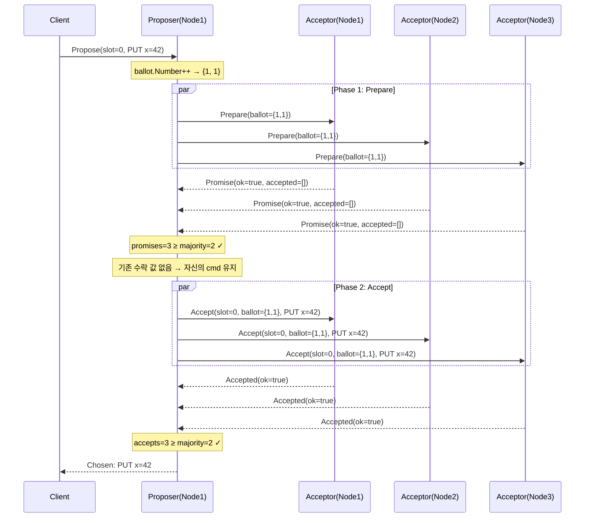
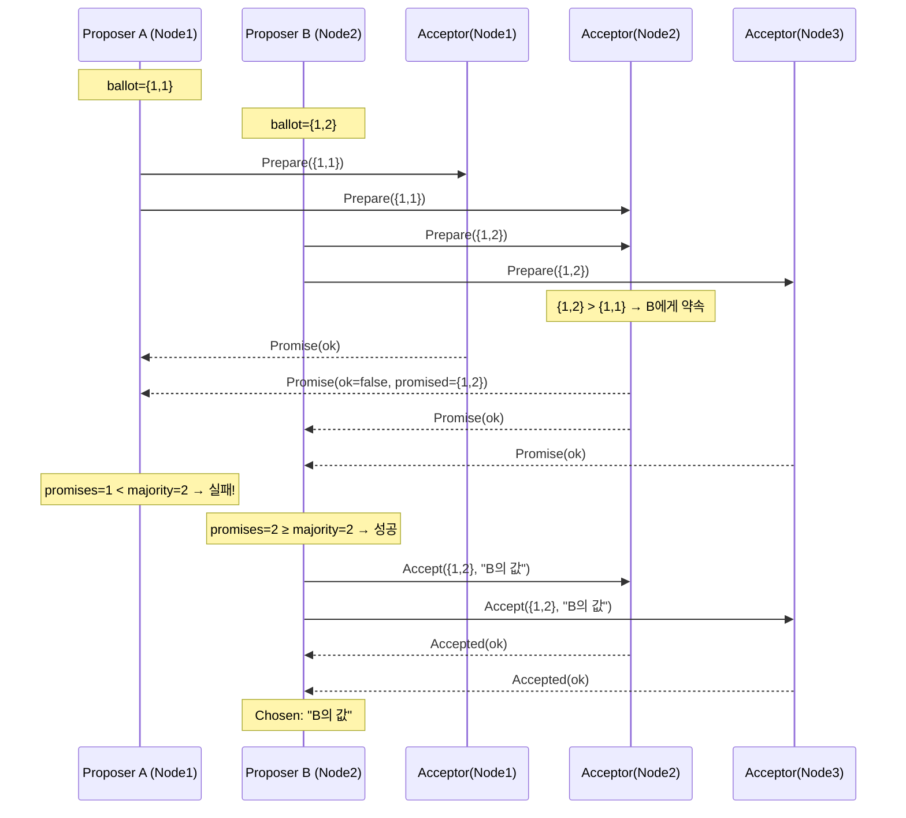

# Proposer 상세 분석

## 목차

1. [개요](#개요)
2. [Paxos에서 Proposer의 역할](#paxos에서-proposer의-역할)
3. [구조체 분석](#구조체-분석)
4. [생성자 분석](#생성자-분석)
5. [Propose 메서드 — 전체 흐름](#propose-메서드--전체-흐름)
6. [Phase 1: Prepare (약속 요청)](#phase-1-prepare-약속-요청)
7. [값 채택 로직 (Paxos의 핵심)](#값-채택-로직-paxos의-핵심)
8. [Phase 2: Accept (수락 요청)](#phase-2-accept-수락-요청)
9. [동시성 설계](#동시성-설계)
10. [Protobuf 메시지 구조](#protobuf-메시지-구조)
11. [전체 시퀀스 다이어그램](#전체-시퀀스-다이어그램)
12. [한계점 및 개선 가능 사항](#한계점-및-개선-가능-사항)

---

## 개요

`proposer.go`는 **Paxos 합의 프로토콜의 Proposer 역할**을 구현한다. Proposer는 클라이언트의 요청(Command)을 받아 클러스터의 모든 Acceptor에게 2단계 프로토콜(Prepare → Accept)을 실행하여 **과반수(majority)의 합의**를 이끌어낸다.

이 구현은 **Multi-Paxos를 지원하는 구조**(slot 파라미터)이지만, 각 `Propose` 호출은 하나의 slot에 대한 **Single-Decree Paxos 인스턴스**를 실행한다.

---

## Paxos에서 Proposer의 역할

```
Client → Proposer → Acceptors (majority) → 합의 완료
```

Proposer는 합의 과정의 **주도자(initiator)**이다:

| 단계 | Proposer가 하는 일 | Acceptor가 하는 일 |
|------|-------------------|-------------------|
| Phase 1 (Prepare) | 고유한 ballot 번호로 "준비 요청" 전송 | ballot이 기존 약속보다 높으면 "약속(promise)" 응답 |
| 값 채택 | 응답에서 가장 높은 ballot의 기존 값을 채택 | — |
| Phase 2 (Accept) | 채택된 값으로 "수락 요청" 전송 | ballot이 약속과 일치하면 "수락(accept)" 응답 |

---

## 구조체 분석

```go
type Proposer struct {
    mu        sync.Mutex           // ballot 증가 시 동시성 보호
    nodeID    uint32               // 이 노드의 고유 ID
    ballot    *pb.Ballot           // 현재 제안 번호 (Number + NodeId)
    peers     []uint32             // 자기 자신을 포함한 모든 노드 ID
    majority  int                  // 과반수 (len(peers)/2 + 1)
    transport transport.Transport  // 노드 간 통신 계층
    log       *slog.Logger         // 구조화된 로거
}
```

### 각 필드의 역할

| 필드 | 타입 | 설명 |
|------|------|------|
| `mu` | `sync.Mutex` | `ballot.Number`를 원자적으로 증가시키기 위한 뮤텍스. 동일 노드에서 여러 goroutine이 동시에 `Propose`를 호출할 때 ballot 충돌을 방지한다. |
| `nodeID` | `uint32` | 클러스터 내에서 이 노드를 식별하는 고유 ID. Ballot의 `NodeId` 필드에 사용되어 동일한 `Number`를 가진 ballot 간의 **타이브레이커** 역할을 한다. |
| `ballot` | `*pb.Ballot` | `{Number, NodeId}` 쌍. 매 Propose 호출마다 `Number`가 1씩 증가한다. Paxos에서 ballot은 **전역적으로 유일한 제안 식별자**이다. |
| `peers` | `[]uint32` | 클러스터의 모든 노드 ID (자기 자신 포함). Prepare/Accept 메시지를 보낼 대상 목록이다. |
| `majority` | `int` | `len(peers)/2 + 1`로 계산. 3노드 클러스터에서는 2, 5노드에서는 3. Phase 1과 Phase 2 모두 이 수 이상의 긍정 응답이 필요하다. |
| `transport` | `transport.Transport` | 노드 간 메시지 전송을 추상화한 인터페이스. 테스트에서는 `InMemoryTransport`, 프로덕션에서는 `GRPCTransport`를 사용한다. |
| `log` | `*slog.Logger` | Go 1.21+ 표준 구조화 로거. 각 단계의 진행 상황을 key-value 형태로 기록한다. |

---

## 생성자 분석

```go
func NewProposer(nodeID uint32, peers []uint32, t transport.Transport, logger *slog.Logger) *Proposer {
    return &Proposer{
        nodeID:    nodeID,
        ballot:    &pb.Ballot{Number: 0, NodeId: nodeID},
        peers:     peers,
        majority:  len(peers)/2 + 1,
        transport: t,
        log:       logger,
    }
}
```

### 핵심 포인트

- **ballot 초기값**: `{Number: 0, NodeId: nodeID}`. Number가 0이므로 첫 번째 Propose에서 1로 증가한다.
- **majority 계산**: 정수 나눗셈 `len(peers)/2 + 1`은 항상 과반수를 보장한다.
  - 3노드: `3/2 + 1 = 2` (2/3 필요)
  - 5노드: `5/2 + 1 = 3` (3/5 필요)
  - 7노드: `7/2 + 1 = 4` (4/7 필요)
- **NodeId가 ballot에 포함되는 이유**: 서로 다른 노드가 같은 Number를 사용하더라도 ballot이 전역적으로 유일하도록 보장한다. `BallotGreaterThan`에서 Number가 같으면 NodeId가 높은 쪽이 우선한다.

---

## Propose 메서드 — 전체 흐름

```go
func (p *Proposer) Propose(ctx context.Context, slot uint64, cmd *pb.Command) (*pb.Command, error)
```

### 파라미터

| 파라미터 | 설명 |
|---------|------|
| `ctx` | 요청 취소/타임아웃을 위한 컨텍스트 |
| `slot` | Multi-Paxos 로그의 슬롯 번호. 각 슬롯은 독립적인 Paxos 인스턴스이다. |
| `cmd` | 제안하려는 명령 (예: `{Op: "PUT", Key: "x", Value: "42"}`) |

### 반환값

| 반환값 | 설명 |
|-------|------|
| `*pb.Command` | 합의된 값. 자신이 제안한 값이 아닐 수 있다 (기존 값 채택 시). |
| `error` | Phase 1 또는 Phase 2에서 과반수를 얻지 못한 경우 에러 반환. |

### 전체 흐름 요약

```
┌─────────────────────────────────────────────────────────┐
│ 1. ballot.Number++ (뮤텍스 보호)                          │
│ 2. ballot 복제 (이후 단계에서 불변 값으로 사용)                │
├─────────────────────────────────────────────────────────┤
│ Phase 1: Prepare                                        │
│  - 모든 peer에게 병렬로 PrepareRequest 전송                │
│  - 응답 수집: Ok=true인 응답만 promises에 추가              │
│  - promises < majority → 에러 반환                       │
├─────────────────────────────────────────────────────────┤
│ 값 채택 로직                                              │
│  - promises에서 해당 slot의 AcceptedEntry 검사             │
│  - 가장 높은 ballot의 값을 채택 (없으면 자신의 cmd 유지)      │
├─────────────────────────────────────────────────────────┤
│ Phase 2: Accept                                         │
│  - 모든 peer에게 병렬로 AcceptRequest 전송                 │
│  - 응답 수집: Ok=true인 응답 카운트                        │
│  - acceptCount < majority → 에러 반환                    │
├─────────────────────────────────────────────────────────┤
│ 성공: 합의된 값(value) 반환                                │
└─────────────────────────────────────────────────────────┘
```

---

## Phase 1: Prepare (약속 요청)

### Ballot 증가

```go
p.mu.Lock()
p.ballot.Number++
ballot := BallotClone(p.ballot)
p.mu.Unlock()
```

- `Number++`로 이전보다 높은 고유한 ballot을 생성한다.
- `BallotClone`으로 복제하여 이후 단계에서 **불변 값**으로 사용한다. 원본 `p.ballot`은 다음 Propose 호출에서 다시 증가될 수 있으므로 복제가 필수적이다.

### 병렬 Prepare 전송

```go
type prepResult struct {
    resp *pb.PrepareResponse
    err  error
}
prepareCh := make(chan prepResult, len(p.peers))

for _, peer := range p.peers {
    go func(to uint32) {
        resp, err := p.transport.SendPrepare(ctx, to, &pb.PrepareRequest{Ballot: ballot})
        prepareCh <- prepResult{resp, err}
    }(peer)
}
```

- **버퍼드 채널** `prepareCh`의 크기는 `len(p.peers)`로, 모든 goroutine이 블로킹 없이 결과를 전송할 수 있다.
- 각 peer에게 **병렬로** PrepareRequest를 전송한다. 자기 자신에게도 전송한다 (자기 자신도 peers에 포함).
- `go func(to uint32)` — `to` 파라미터로 루프 변수를 캡처하여 goroutine 클로저 문제를 방지한다.

### 응답 수집

```go
var promises []*pb.PrepareResponse
for range p.peers {
    res := <-prepareCh
    if res.err != nil {
        p.log.Debug("proposer: prepare failed", ...)
        continue
    }
    if res.resp.Ok {
        promises = append(promises, res.resp)
    }
}
```

- **모든 peer의 응답을 기다린다** (성공이든 실패든). 타임아웃은 `ctx`에 의존한다.
- 에러 응답 (네트워크 장애, 노드 다운): 무시하고 다음으로 진행.
- `Ok=false` 응답 (더 높은 ballot에 이미 약속): 역시 무시.
- `Ok=true` 응답만 `promises`에 추가.

### 과반수 검증

```go
if len(promises) < p.majority {
    return nil, fmt.Errorf("proposer: prepare failed, need %d promises, got %d", p.majority, len(promises))
}
```

과반수 미달 시 즉시 실패를 반환한다. 이는 다음 상황에서 발생한다:
- 다수의 노드가 다운된 경우
- 다른 Proposer가 더 높은 ballot으로 이미 약속을 받은 경우

---

## 값 채택 로직 (Paxos의 핵심)

```go
value := cmd
var highestBallot *pb.Ballot

for _, promise := range promises {
    for _, entry := range promise.AcceptedEntries {
        if entry.Slot == slot {
            if highestBallot == nil || BallotGreaterThan(entry.Ballot, highestBallot) {
                highestBallot = entry.Ballot
                value = entry.Command
            }
        }
    }
}
```

이 로직은 **Paxos 안전성(safety)의 핵심**이다.

### 왜 필요한가?

이전 Proposer가 Phase 2까지 진행했지만 커밋 전에 실패한 경우를 생각해보자:

```
시간 →
Proposer A: Prepare(1) → Promise ← Accept(1, "hello") → [crash]
Proposer B: Prepare(2) → Promise(accepted: ballot=1, "hello") ← ...
```

Proposer B는 Phase 1 응답에서 Acceptor가 이미 `"hello"`를 수락했음을 발견한다. 이때 Proposer B는 **자신의 값을 버리고 `"hello"`를 채택해야 한다**. 그렇지 않으면 두 개의 다른 값이 합의될 수 있어 Paxos의 안전성이 깨진다.

### 알고리즘

1. 기본값으로 자신의 `cmd`를 설정한다.
2. 모든 promise의 `AcceptedEntries`를 순회한다.
3. 해당 `slot`에 대한 entry 중 **가장 높은 ballot**의 값을 채택한다.
4. 기존에 수락된 값이 없으면 자신의 `cmd`가 그대로 사용된다.

### 안전성 보장 원리

- 과반수의 promise를 받았다는 것은, 이전에 합의된 값이 있다면 **반드시 하나 이상의 promise에 포함**되어 있다는 뜻이다.
- 왜냐하면 이전 합의도 과반수가 필요했고, 두 과반수 집합은 반드시 교집합이 존재하기 때문이다 (비둘기집 원리).

---

## Phase 2: Accept (수락 요청)

### 병렬 Accept 전송

```go
type acceptResult struct {
    resp *pb.AcceptResponse
    err  error
}
acceptCh := make(chan acceptResult, len(p.peers))

for _, peer := range p.peers {
    go func(to uint32) {
        resp, err := p.transport.SendAccept(ctx, to, &pb.AcceptRequest{
            Slot: slot, Ballot: ballot, Command: value,
        })
        acceptCh <- acceptResult{resp, err}
    }(peer)
}
```

Phase 1과 동일한 패턴으로 모든 peer에게 병렬 전송한다. `AcceptRequest`에는:
- `Slot`: 합의 대상 슬롯 번호
- `Ballot`: Phase 1에서 사용한 것과 **동일한 ballot**
- `Command`: 채택된 값 (자신의 cmd 또는 기존 값)

### 응답 수집 및 과반수 검증

```go
acceptCount := 0
for range p.peers {
    res := <-acceptCh
    if res.err != nil {
        continue
    }
    if res.resp.Ok {
        acceptCount++
    }
}

if acceptCount < p.majority {
    return nil, fmt.Errorf("proposer: accept failed, need %d accepts, got %d", p.majority, acceptCount)
}
```

- Phase 1과 동일하게 에러/거절 응답은 무시하고 `Ok=true`만 카운트한다.
- 과반수 미달 시 실패. 이는 Phase 1과 Phase 2 사이에 **다른 Proposer가 더 높은 ballot으로 Prepare를 성공**시킨 경우 발생한다.

### 성공

```go
return value, nil
```

과반수의 Accept를 받으면 값이 **chosen(선택됨)** 상태가 된다. 반환된 값은 호출자가 제안한 `cmd`가 아닐 수 있다 (값 채택 로직에 의해 변경되었을 수 있음).

---

## 동시성 설계

### Mutex 범위

```go
p.mu.Lock()
p.ballot.Number++
ballot := BallotClone(p.ballot)
p.mu.Unlock()
```

뮤텍스는 **ballot 증가와 복제**에만 사용된다. Phase 1/Phase 2의 네트워크 I/O 동안에는 뮤텍스를 잡지 않는다. 이는 중요한 설계 결정이다:

- **좋은 점**: 네트워크 대기 중에도 다른 goroutine이 `Propose`를 호출할 수 있다.
- **주의점**: 동일 노드에서 두 개의 `Propose`가 동시에 실행되면 서로 다른 ballot으로 경쟁하게 된다. 이는 Paxos 프로토콜상 안전하지만 효율성이 떨어질 수 있다.

### Goroutine 패턴

```
Propose goroutine
    ├── goroutine: SendPrepare(peer1) ──┐
    ├── goroutine: SendPrepare(peer2) ──┤── prepareCh ──→ 수집
    └── goroutine: SendPrepare(peer3) ──┘
    
    ├── goroutine: SendAccept(peer1) ───┐
    ├── goroutine: SendAccept(peer2) ───┤── acceptCh ──→ 수집
    └── goroutine: SendAccept(peer3) ───┘
```

- **Fan-out**: 각 peer에게 goroutine을 생성하여 병렬 전송.
- **Fan-in**: 버퍼드 채널로 결과를 수집.
- **동기적 수집**: `for range p.peers`로 모든 응답을 기다린 후 다음 단계로 진행.

---

## Protobuf 메시지 구조

### Phase 1에서 사용되는 메시지

```protobuf
message PrepareRequest {
    Ballot ballot = 1;          // Proposer의 제안 번호
}

message PrepareResponse {
    bool ok = 1;                // 약속 여부
    Ballot promised_ballot = 2; // 거절 시: 이미 약속한 더 높은 ballot
    repeated AcceptedEntry accepted_entries = 3;  // 이미 수락한 값들
}

message AcceptedEntry {
    uint64 slot = 1;            // 슬롯 번호
    Ballot ballot = 2;          // 수락 시의 ballot
    Command command = 3;        // 수락한 값
}
```

### Phase 2에서 사용되는 메시지

```protobuf
message AcceptRequest {
    uint64 slot = 1;            // 합의 대상 슬롯
    Ballot ballot = 2;          // Phase 1과 동일한 ballot
    Command command = 3;        // 채택된 값
}

message AcceptResponse {
    bool ok = 1;                // 수락 여부
    Ballot promised_ballot = 2; // 거절 시: 더 높은 ballot
}
```

### Ballot 구조

```protobuf
message Ballot {
    uint64 number = 1;   // 단조 증가하는 제안 번호
    uint32 node_id = 2;  // 노드 ID (타이브레이커)
}
```

비교 규칙: `(number_a, node_id_a) > (number_b, node_id_b)` — number 우선, 같으면 node_id로 비교.

---

## 전체 시퀀스 다이어그램

### 정상 케이스 (단일 Proposer)



### 경쟁 케이스 (두 Proposer)



---

## 한계점 및 개선 가능 사항

| 항목 | 현재 상태 | 개선 방향 |
|------|----------|----------|
| **재시도 없음** | Phase 1/2 실패 시 에러 반환 후 종료 | ballot을 증가시켜 자동 재시도 (exponential backoff) |
| **조기 종료 없음** | 모든 peer의 응답을 기다림 | 과반수 도달 시 나머지 응답 무시 (early return) |
| **Commit 단계 없음** | 값이 chosen되어도 다른 노드에 알리지 않음 | Phase 3: Commit 메시지를 브로드캐스트하여 모든 노드가 결과를 학습 |
| **Ballot 충돌 학습 없음** | 거절 시 상대의 ballot을 무시 | 거절 응답의 `promised_ballot`을 확인하여 자신의 ballot을 더 높게 설정 |
| **컨텍스트 활용 부족** | `ctx`를 전달하지만 타임아웃/취소 처리 없음 | `select`로 ctx.Done()을 감지하여 조기 종료 |
